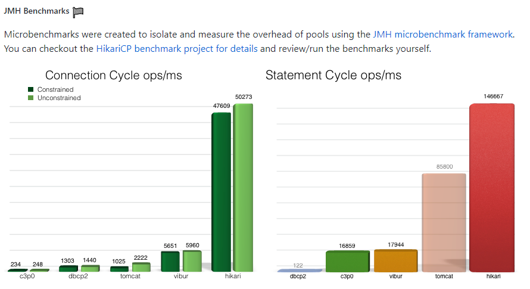
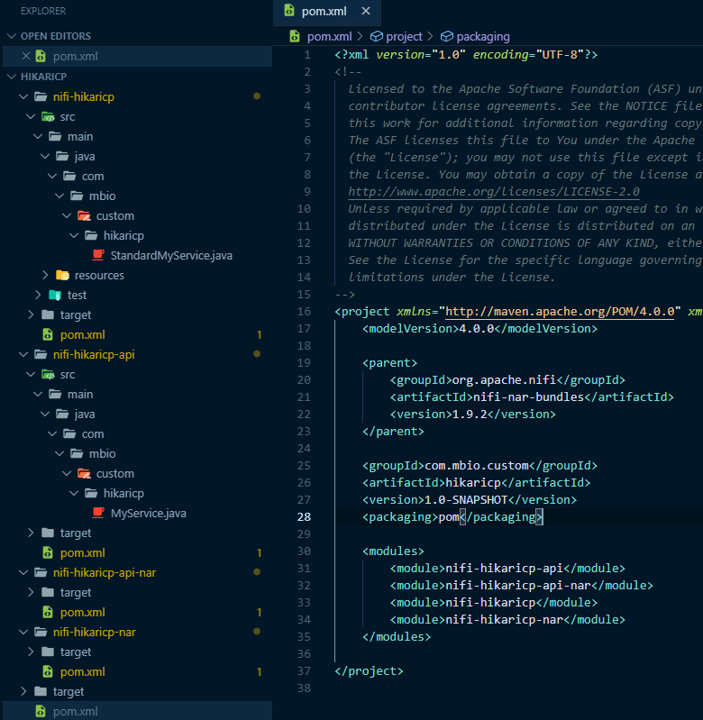
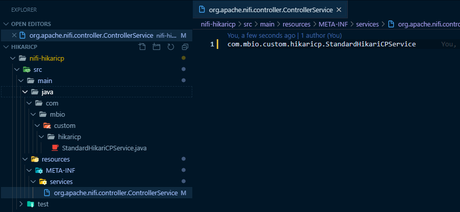
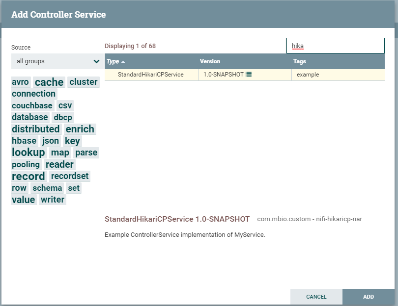

# HikariCP Controller Service 

## HikariCPControllerService - 1

### HikariCP 소개

[HikariCP](https://github.com/brettwooldridge/HikariCP)는 spring boot 2버전 부터 tomcat jdbc를 제치고 default dbcp 로 채택되면서 주목을 받았습니다.

HikariCP에서 제공하는 벤치마크 결과를 보면 타 dbcp framework에 비해 아주 좋은 성능을 가지고 있는 것을 확인할 수 있습니다.

좋은 성능을 가지고 있는 것을 확인했으니, 우리가 사용할 DB를 잘 지원하는지 확인해봅니다.  

아래 표는 HikariCP에서 DataSource 를 이용해서 커넥션을 맺을 수 있는 Database 목록입니다.  

제가 알고 있는 대부분의 db를 지원하고 있고, 회사에서 사용하는 sybase와 개인적으로 사용하는 PostegreSQL까지 지원합니다.

MySQL는 취소선이 그어져 있지만 상관없습니다. HikariCP는 datasource를 이용한 커넥션을 맺는 것을 추천할 뿐 jdbc driver만 있으면 전통적인 jdbc url을 이용해서 connection을 맺을 수도 있습니다. 

실제로 아래 표에 표시되어있지 않지만 회사에서 사용하는 SAP HANA DB도 NiFi에서는 HikariCP를 이용하여 커넥션을 맺고 있습니다.

| Database         | Driver       | *DataSource* class |
|:---------------- |:------------ |:-------------------|
| Apache Derby     | Derby        | org.apache.derby.jdbc.ClientDataSource |
| Firebird         | Jaybird      | org.firebirdsql.ds.FBSimpleDataSource |
| H2               | H2           | org.h2.jdbcx.JdbcDataSource |
| HSQLDB           | HSQLDB       | org.hsqldb.jdbc.JDBCDataSource |
| IBM DB2          | IBM JCC      | com.ibm.db2.jcc.DB2SimpleDataSource |
| IBM Informix     | IBM Informix | com.informix.jdbcx.IfxDataSource |
| MS SQL Server    | Microsoft    | com.microsoft.sqlserver.jdbc.SQLServerDataSource |
| ~~MySQL~~        | Connector/J  | ~~com.mysql.jdbc.jdbc2.optional.MysqlDataSource~~ |
| MariaDB          | MariaDB      | org.mariadb.jdbc.MariaDbDataSource |
| Oracle           | Oracle       | oracle.jdbc.pool.OracleDataSource |
| OrientDB         | OrientDB     | com.orientechnologies.orient.jdbc.OrientDataSource |
| PostgreSQL       | pgjdbc-ng    | com.impossibl.postgres.jdbc.PGDataSource |
| PostgreSQL       | PostgreSQL   | org.postgresql.ds.PGSimpleDataSource |
| SAP MaxDB        | SAP          | com.sap.dbtech.jdbc.DriverSapDB |
| SQLite           | xerial       | org.sqlite.SQLiteDataSource |
| SyBase           | jConnect     | com.sybase.jdbc4.jdbc.SybDataSource |

이제 우리가 사용하는 DB도 기본적으로 지원이 되는 것을 확인했으니 HikariCP를 이용해서 service로 만들어 보겠습니다.

### 프로젝트 이름 변경

이제 만들 프로젝트가 정해졌으니 프로젝트 이름을 깔끔하게 변경해줍니다.

-----------

이걸 커스텀 프로세서로 작성해봅시다.

### 프로젝트 이름 변경

이제 만들 프로젝트가 정해졌으니 프로젝트 이름을 변경해줍니다.

archetype으로 프로젝트를 만들때 패키지 명이나 이름을 대충 쓰셧다면 이때 변경해줍니다.

귀찮으시면 제대로 naming을 해서 archetype을 새로 만드셔도됩니다.

특히 java의 package명은 소문자여야 되기 때문에 이런부분을 잘 신경써서 만들어주시면됩니다.

pom.xml 과 폴더명까지 hikaricp로 변경해줍니다.  

그리고 StandardMyService의 이름도 HikariCPService로 변경해줍니다.

Service의 이름을 변경하면 아래 파일의 이름도 반드시 변경해야합니다.  
META-INF의 파일을 보고 어떤 class가 main Processor class인지 판단하기 때문에
반드시 수정해줘야합니다.

수정이 끝나고 다시 maven빌드 후 배포해보면 아래처럼 service의 이름이 변경된 것을 확인 할 수 있습니다.

여기까지 내용은 아래 github에서 소스를 받으실 수 있습니다.

[HikariCPControllerService-1](https://github.com/qnwlqnwlxm/HikariCPService/tree/HikariCPControllerSerivce-1)