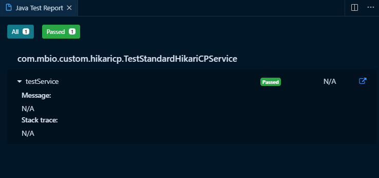
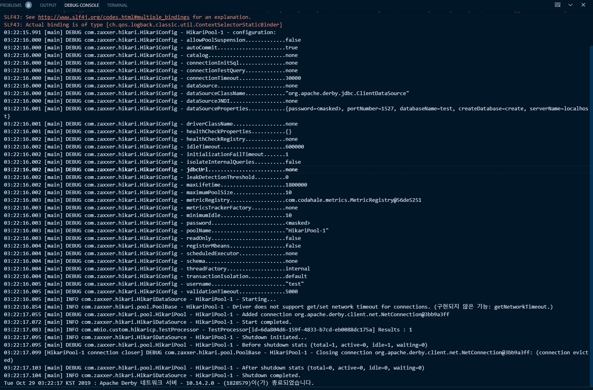
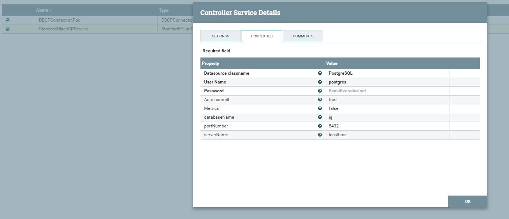
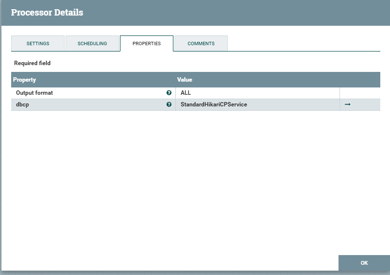
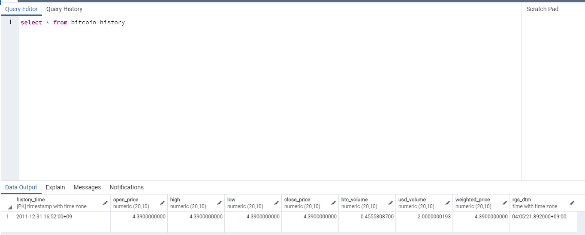

# HikariCP Controller Service 

## HikariCPControllerService - 3

### Test코드 작성

test코드도 간단합니다.

controller service를 수행할 간단한 processor를 정의하고, 해당 processor를 이용해 controller service가 정상 동작하는지 확인하면됩니다.

Test를 위한 TestProcessor.java의 코드는 다음과 같습니다.

<details ><summary>TestProcessor.java</summary>
<p>

```java
import java.sql.Connection;
import java.sql.ResultSet;
import java.sql.Statement;
import java.util.ArrayList;
import java.util.List;
import org.apache.nifi.annotation.lifecycle.OnScheduled;
import org.apache.nifi.components.PropertyDescriptor;
import org.apache.nifi.processor.AbstractProcessor;
import org.apache.nifi.processor.ProcessContext;
import org.apache.nifi.processor.ProcessSession;
import org.apache.nifi.processor.exception.ProcessException;

public class TestProcessor extends AbstractProcessor {

    public static final PropertyDescriptor DS_PROP = new PropertyDescriptor.Builder().name("dbcp")
            .description("HikariCPService test processor").identifiesControllerService(HikariCPService.class)
            .required(true).build();

    @Override
    public void onTrigger(ProcessContext context, ProcessSession session) throws ProcessException {
    }

    @Override
    protected List<PropertyDescriptor> getSupportedPropertyDescriptors() {
        List<PropertyDescriptor> propDescs = new ArrayList<>();
        propDescs.add(DS_PROP);
        return propDescs;
    }

    @OnScheduled
    public void onScheduled(final ProcessContext context) {

        HikariCPService dbcpService = (HikariCPService) context.getProperty(DS_PROP).asControllerService();

        try (Connection conn = dbcpService.getConnection();
                Statement stmt = conn.createStatement();
                ResultSet rs = stmt.executeQuery("values 1")) {

            while (rs.next()) {
                getLogger().info("Results : " + rs.getObject(1));
            }
        } catch (Exception e) {
            getLogger().error("Problem testing connection", e);
        }
    }
}
```

</p>
</details>

실제 테스트를 수행할 TestStandardHikariCPService class의 소스는 다음과 같습니다.


<details ><summary>TestStandardHikariCPService.java</summary>
<p>

```java
import java.io.PrintWriter;
import org.apache.derby.drda.NetworkServerControl;
import org.apache.derby.jdbc.ClientDataSource;
import org.apache.nifi.reporting.InitializationException;
import org.apache.nifi.util.TestRunner;
import org.apache.nifi.util.TestRunners;
import org.junit.AfterClass;
import org.junit.BeforeClass;
import org.junit.Test;

public class TestStandardHikariCPService {
  
  private static NetworkServerControl derby;
  
    @BeforeClass
    public static void init() throws Exception {
      derby = new NetworkServerControl();
      derby.start(new PrintWriter(System.out));
    }
    
    @AfterClass
    public static void stop() throws Exception {
      derby.shutdown();
    }
    
    @Test
    public void testService() throws InitializationException {
        final TestRunner runner = TestRunners.newTestRunner(TestProcessor.class);
        final StandardHikariCPService service = new StandardHikariCPService();
        runner.addControllerService("dbcp", service);
        
        runner.setProperty(service, ConfigUtil.DATASOURCE_CLASSNAME, ClientDataSource.class.getName());
        runner.setProperty(service, ConfigUtil.USERNAME, "test");
        runner.setProperty(service, ConfigUtil.PASSWORD, "test");
        runner.setProperty(service, ConfigUtil.AUTO_COMMIT, "true");
        runner.setProperty(service, ConfigUtil.METRICS, "true");
        
        runner.setProperty(service, "databaseName", "test");
        runner.setProperty(service, "createDatabase", "create");
        runner.setProperty(service, "serverName", "localhost");
        runner.setProperty(service, "portNumber", "1527");
        runner.enableControllerService(service);
        runner.setProperty(TestProcessor.DS_PROP, "dbcp");
        
        runner.run();

        runner.assertValid(service);
        runner.disableControllerService(service);
        runner.shutdown();
    }

}
```

</p>
</details>

### Test 수행 결과 확인

Junit 테스트를 수행하고 결과를 확인했을때 다음과 같이 나오면 성공입니다.



로그에서도 정상적으로 HikariCP를 이용해 커넥션을 맺은 것을 확인할 수 있습니다.



### NiFi 배포후 수행 결과 확인

이제 NiFi에 배포한 후에 기존에 만들었던 kaggle bitcoin history processor에서 DBCPservice를 hikariCP로 변경한 후에 정상적으로 수행되는지 확인합니다.

controller service를 활성화해줍니다.



기존 bitcoint history processor에서 dbcp를 방금 추가한 HikariCP로 변경합니다.



수행후 db에 정상적으로 적재된 것을 확인할 수 있습니다.



----------------
  
변경사항은 아래에서 확인할 수 있습니다.

[https://github.com/qnwlqnwlxm/HikariCPService/pull/3/files](https://github.com/qnwlqnwlxm/HikariCPService/pull/3/files)


전체소스는 아래 에서 다운로드 가능합니다.
[https://github.com/qnwlqnwlxm/HikariCPService/tree/HikariCPControllerSerivce-3](https://github.com/qnwlqnwlxm/HikariCPService/tree/HikariCPControllerSerivce-3)