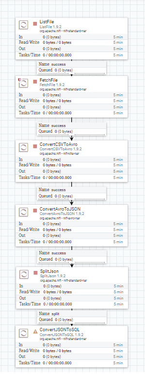
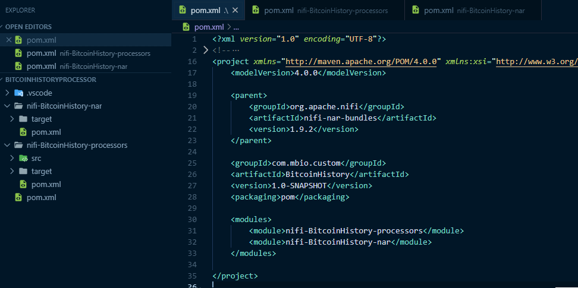
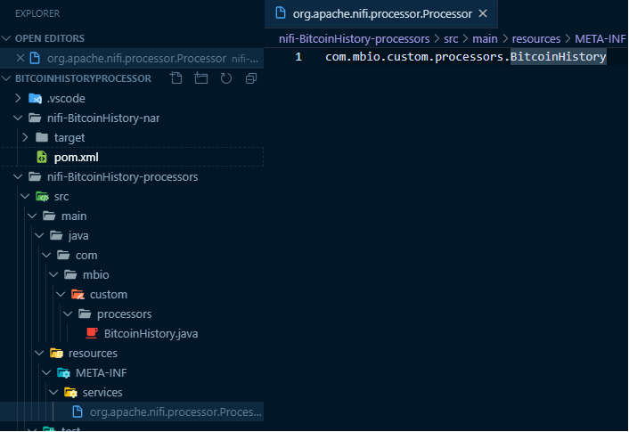
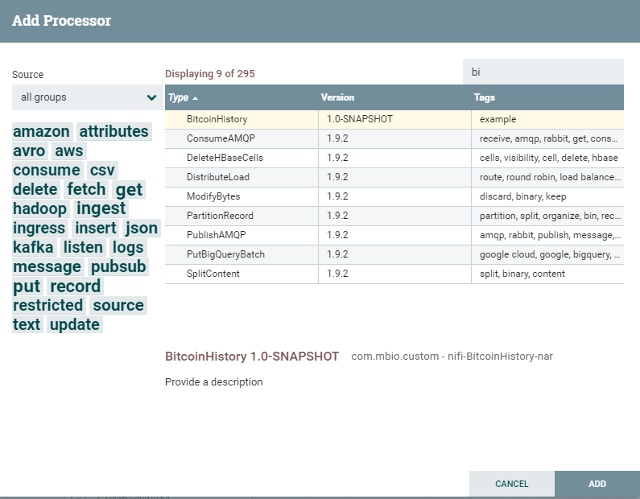

# Kaggle Bitcoin History data processor

## BitcoinHistoryProcessor - 1

### 프로세서 소개

[Kaggle](https://www.kaggle.com/)에서 제공하는 [Bitcoing History data](https://www.kaggle.com/mczielinski/bitcoin-historical-data/version/1)를 핸들링하는 프로세서를 만들어봅니다.

데이터는 아래와 같은 형태로 심플한 csv 파일입니다.

이러한 데이터를 별도의 custom 프로세서없이 json 또는 xml로 형변환 하거나 db에  
넣기위해서는 여러 processor를 조합해서 사용해야합니다.  
csv파일을 가져와서 avro로 형변환하고, json 변환후 db적재 하는 로직을  
대략 flow로 그려봐도 아래와 같은 그림이 나옵니다.

여기에 csv파일을 avro로 변환하기위한 avro schema를 짜는 일도 추가됩니다.  
추가로 file format을 다르게 받고싶다거나 하는 요건이 추가되면 처리해야할일이
더 많아 집니다.  

이걸 커스텀 프로세서로 작성해봅시다.

### 프로젝트 이름 변경

이제 만들 프로젝트가 정해졌으니 프로젝트 이름을 변경해줍니다.

pom.xml 과 폴더명까지 BitcoinHistory로 변경해줍니다.  

그리고 MyProcessor의 이름도 BitcoinHistory로 변경해줍니다.

프로세서의 이름을 변경하면 아래 파일의 이름도 반드시 변경해야합니다.  
META-INF의 파일을 보고 어떤 class가 main Processor class인지 판단하기 때문에
반드시 수정해줘야합니다.

수정이 끝나고 다시 maven빌드 후 배포해보면 아래처럼 processor의 이름이 변경된 것을 확인 할 수 있습니다.

여기까지 내용은 아래 github에서 소스를 받으실 수 있습니다.

[kaggle-bitcoin-1](https://github.com/qnwlqnwlxm/BitcoinHistoryProcessor/tree/kaggle-bitcoin-1)