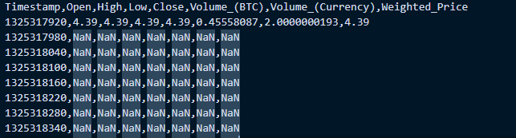
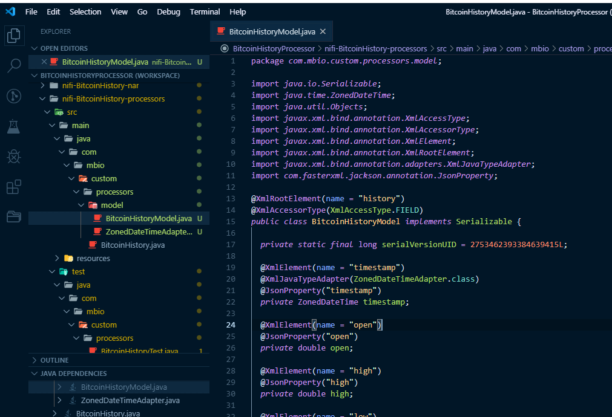
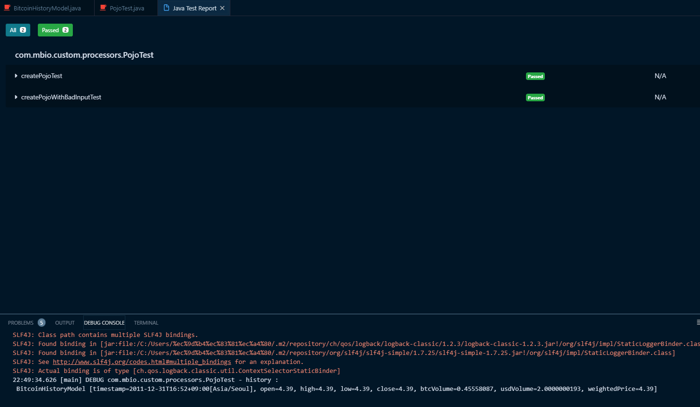

# Kaggle Bitcoin History data processor

## BitcoinHistoryProcessor - 2 

### POJO생성을 위한 dependency 추가

아래와 같은 csv파일을 객체화하여 다루기 위해 POJO class를 작성합니다.



xml 포맷을 위한 jaxb와 json을 위한 jackson을 추가해줍니다.
csv파일을 핸들링해야하니 apache common csv라이브러리도 추가해줍니다.

디팬던시 추가시 multi module maven project이니 버전관리의 용이성을 위해 부모 pom.xml에 dependencyManagement 태그를 추가하여 하위 pom에서 상속해서 사용하는게 좋습니다.

아래 내용을 최상위 pom.xml에 추가해줍니다.

<details ><summary>parent pom.xml</summary>
<p>

```xml
    <properties>
		<commons.csv.version>1.6</commons.csv.version>
		<jaxb.version>2.3.0.1</jaxb.version>
		<jackson.version>2.9.8</jackson.version>
	</properties>

    <dependencyManagement>
        <dependencies>
            <dependency>
				<groupId>org.apache.commons</groupId>
				<artifactId>commons-csv</artifactId>
				<version>${commons.csv.version}</version>
            </dependency>
            <dependency>
				<groupId>org.glassfish.jaxb</groupId>
				<artifactId>jaxb-runtime</artifactId>
				<version>${jaxb.version}</version>
			</dependency>
			<dependency>
				<groupId>org.glassfish.jaxb</groupId>
				<artifactId>jaxb-core</artifactId>
				<version>${jaxb.version}</version>
			</dependency>
			<dependency>
				<groupId>com.fasterxml.jackson.core</groupId>
				<artifactId>jackson-databind</artifactId>
				<version>${jackson.version}</version>
			</dependency>
			<dependency>
				<groupId>com.fasterxml.jackson.core</groupId>
				<artifactId>jackson-core</artifactId>
				<version>${jackson.version}</version>
			</dependency>
			<dependency>
				<groupId>com.fasterxml.jackson.core</groupId>
				<artifactId>jackson-annotations</artifactId>
				<version>${jackson.version}</version>
			</dependency>
			<dependency>
				<groupId>com.fasterxml.jackson.datatype</groupId>
				<artifactId>jackson-datatype-jsr310</artifactId>
				<version>${jackson.version}</version>
			</dependency>
        </dependencies>
    </dependencyManagement>
```

</p>
</details>
  
  
최상위 pom.xml에 dependency를 추가했으면 processor의 pom.xml에도 dependency를 추가해줍니다.

<details ><summary>nifi-BitcoinHistory-processors pom.xml</summary>
<p>

```xml
        <dependency>
			<groupId>org.apache.commons</groupId>
			<artifactId>commons-csv</artifactId>
		</dependency>
		<dependency>
			<groupId>org.glassfish.jaxb</groupId>
			<artifactId>jaxb-runtime</artifactId>
		</dependency>
		<dependency>
			<groupId>org.glassfish.jaxb</groupId>
			<artifactId>jaxb-core</artifactId>
		</dependency>
		<dependency>
			<groupId>com.fasterxml.jackson.core</groupId>
			<artifactId>jackson-databind</artifactId>
		</dependency>
		<dependency>
			<groupId>com.fasterxml.jackson.core</groupId>
			<artifactId>jackson-core</artifactId>
		</dependency>
		<dependency>
			<groupId>com.fasterxml.jackson.core</groupId>
			<artifactId>jackson-annotations</artifactId>
		</dependency>
		<dependency>
			<groupId>com.fasterxml.jackson.datatype</groupId>
			<artifactId>jackson-datatype-jsr310</artifactId>
		</dependency>
```

</p>
</details>
  
  
### POJO생성

이제 dependency추가도 끝났으니 POJO를 생성해봅니다.

BitcoinHistory processor에 model 패키지를 추가하고 POJO class를 작성합니다.



POJO의 전체 소스는 아래와 같습니다.

<details ><summary>nifi-BitcoinHistory-processors BitcoinHistoryModel</summary>
<p>


```java

import java.io.Serializable;
import java.time.ZonedDateTime;
import java.util.Objects;
import javax.xml.bind.annotation.XmlAccessType;
import javax.xml.bind.annotation.XmlAccessorType;
import javax.xml.bind.annotation.XmlElement;
import javax.xml.bind.annotation.XmlRootElement;
import javax.xml.bind.annotation.adapters.XmlJavaTypeAdapter;
import com.fasterxml.jackson.annotation.JsonProperty;

@XmlRootElement(name = "history")
@XmlAccessorType(XmlAccessType.FIELD)
public class BitcoinHistoryModel implements Serializable {

  private static final long serialVersionUID = 2753462393384639415L;

  @XmlElement(name = "timestamp")
  @XmlJavaTypeAdapter(ZonedDateTimeAdapter.class)
  @JsonProperty("timestamp")
  private ZonedDateTime timestamp;

  @XmlElement(name = "open")
  @JsonProperty("open")
  private double open;

  @XmlElement(name = "high")
  @JsonProperty("high")
  private double high;

  @XmlElement(name = "low")
  @JsonProperty("low")
  private double low;

  @XmlElement(name = "close")
  @JsonProperty("close")
  private double close;

  @XmlElement(name = "btc-volume")
  @JsonProperty("btcVolume")
  private double btcVolume;

  @XmlElement(name = "usd-volume")
  @JsonProperty("usdVolume")
  private double usdVolume;

  @XmlElement(name = "weighted-price")
  @JsonProperty("weightedPrice")
  private double weightedPrice;

  public ZonedDateTime getTimestamp() {
    return timestamp;
  }

  public void setTimestamp(ZonedDateTime timestamp) {
    this.timestamp = timestamp;
  }

  public double getOpen() {
    return open;
  }

  public void setOpen(double open) {
    this.open = open;
  }

  public double getHigh() {
    return high;
  }

  public void setHigh(double high) {
    this.high = high;
  }

  public double getLow() {
    return low;
  }

  public void setLow(double low) {
    this.low = low;
  }

  public double getClose() {
    return close;
  }

  public void setClose(double close) {
    this.close = close;
  }

  public double getBtcVolume() {
    return btcVolume;
  }

  public void setBtcVolume(double btcVolume) {
    this.btcVolume = btcVolume;
  }

  public double getUsdVolume() {
    return usdVolume;
  }

  public void setUsdVolume(double usdVolume) {
    this.usdVolume = usdVolume;
  }

  public double getWeightedPrice() {
    return weightedPrice;
  }

  public void setWeightedPrice(double weightedPrice) {
    this.weightedPrice = weightedPrice;
  }

  @Override
  public int hashCode() {
    return Objects.hash(btcVolume, close, high, low, open, timestamp, usdVolume, weightedPrice);
  }

  @Override
  public boolean equals(Object obj) {
    if (this == obj)
      return true;
    if (obj == null)
      return false;
    if (getClass() != obj.getClass())
      return false;
      BitcoinHistoryModel other = (BitcoinHistoryModel) obj;
    return Double.doubleToLongBits(btcVolume) == Double.doubleToLongBits(other.btcVolume)
        && Double.doubleToLongBits(close) == Double.doubleToLongBits(other.close)
        && Double.doubleToLongBits(high) == Double.doubleToLongBits(other.high)
        && Double.doubleToLongBits(low) == Double.doubleToLongBits(other.low)
        && Double.doubleToLongBits(open) == Double.doubleToLongBits(other.open)
        && Objects.equals(timestamp, other.timestamp)
        && Double.doubleToLongBits(usdVolume) == Double.doubleToLongBits(other.usdVolume)
        && Double.doubleToLongBits(weightedPrice) == Double.doubleToLongBits(other.weightedPrice);
  }

  @Override
  public String toString() {
    return "BitcoinHistoryModel [timestamp=" + timestamp + ", open=" + open + ", high=" + high + ", low="
        + low + ", close=" + close + ", btcVolume=" + btcVolume + ", usdVolume=" + usdVolume
        + ", weightedPrice=" + weightedPrice + "]";
  }

```

</p>
</details>
  
  
추가로 timestamp를 처기하기 위한 ZonedDateTimeAdapter class도 작성합니다.


<details ><summary>nifi-BitcoinHistory-processors ZonedDateTimeAdapter</summary>
<p>

```java
import java.time.ZonedDateTime;
import javax.xml.bind.annotation.adapters.XmlAdapter;

public class ZonedDateTimeAdapter extends XmlAdapter<String, ZonedDateTime> {

  @Override
  public ZonedDateTime unmarshal(String value) throws Exception {
    return ZonedDateTime.parse(value);
  }

  @Override
  public String marshal(ZonedDateTime value) throws Exception {
    if (value != null) {
      return value.toString();
    } else {
      return null;
    }
  }

```

</p>
</details>
  

### POJO 클래스 테스트

이제 모델을 작성했으니 sample file을 읽어서 정상적으로 객체화 되는지 확인해봅니다.

[success input file](https://github.com/qnwlqnwlxm/BitcoinHistoryProcessor/blob/kaggle-bitcoin-2/nifi-BitcoinHistory-processors/src/test/resources/test.csv)  
[bad input file](https://github.com/qnwlqnwlxm/BitcoinHistoryProcessor/blob/kaggle-bitcoin-2/nifi-BitcoinHistory-processors/src/test/resources/bad.csv)

sample 파일을 test/resources에 위치시키고

아래처럼 Junit 코드를 작성합니다.

NaN이 포함된 row는 제외하고 
createModel method가 정상적으로 작동하는지 확인합니다.


<details><summary>PojoTest</summary>
<p>

```java

import java.io.BufferedReader;
import java.io.InputStream;
import java.io.InputStreamReader;
import java.time.Instant;
import java.time.ZoneId;
import java.time.ZonedDateTime;

import com.mbio.custom.processors.model.BitcoinHistoryModel;

import org.apache.commons.csv.CSVFormat;
import org.apache.commons.csv.CSVRecord;
import org.junit.Test;
import org.slf4j.Logger;
import org.slf4j.LoggerFactory;

public class PojoTest {

    Logger logger = LoggerFactory.getLogger(PojoTest.class);

    private static final String TEST_FILE = "test.csv";
    private static final String BAD_TEST_FILE = "bad.csv";

    @Test
    public void createPojoTest() throws Exception {
        try (InputStream in = ClassLoader.getSystemResourceAsStream(TEST_FILE);
                final BufferedReader reader = new BufferedReader(new InputStreamReader(in));) {
            final Iterable<CSVRecord> records = CSVFormat.RFC4180.withFirstRecordAsHeader().parse(reader);
            for (final CSVRecord record : records) {
                if (isValid(record)) {
                    final BitcoinHistoryModel history = createModel(record);
                    logger.debug("history : \n {}", new Object[] {history});
                }   
            }
        } catch (Exception e) {
            logger.debug("Error Processing input", e);
        }
    }

    @Test(expected = NumberFormatException.class)
    public void createPojoWithBadInputTest() throws Exception {
        try (InputStream in = ClassLoader.getSystemResourceAsStream(BAD_TEST_FILE);
                final BufferedReader reader = new BufferedReader(new InputStreamReader(in));) {
            final Iterable<CSVRecord> records = CSVFormat.RFC4180.withFirstRecordAsHeader().parse(reader);
            for (final CSVRecord record : records) {
                if (isValid(record)) {
                    final BitcoinHistoryModel history = createModel(record);
                    logger.debug("history : \n {}", new Object[] {history});
                } 
            }
        }
    }

    private BitcoinHistoryModel createModel(final CSVRecord record) {
        final BitcoinHistoryModel history = new BitcoinHistoryModel();

        final long unixTimestamp = Long.parseLong(record.get("Timestamp"));
        final Instant instant = Instant.ofEpochSecond(unixTimestamp);
        final ZonedDateTime timestamp = ZonedDateTime.ofInstant(instant, ZoneId.systemDefault());

        final double open = Double.parseDouble(record.get("Open"));
        final double high = Double.parseDouble(record.get("High"));
        final double low = Double.parseDouble(record.get("Low"));
        final double close = Double.parseDouble(record.get("Close"));
        final double btcVolume = Double.parseDouble(record.get("Volume_(BTC)"));
        final double usdVolume = Double.parseDouble(record.get("Volume_(Currency)"));
        final double weightedPrice = Double.parseDouble(record.get("Weighted_Price"));

        history.setTimestamp(timestamp);
        history.setOpen(open);
        history.setHigh(high);
        history.setLow(low);
        history.setClose(close);
        history.setBtcVolume(btcVolume);
        history.setUsdVolume(usdVolume);
        history.setWeightedPrice(weightedPrice);

        return history;
    }

    private boolean isValid(final CSVRecord record) {
        return !record.toString().contains("NaN");
    }

}

```

</p>
</details>
  

아래처럼 Junit테스트가 성공하면 정상적으로 객체화 된 것입니다.



  
변경사항은 아래에서 확인할 수 있습니다.

https://github.com/qnwlqnwlxm/BitcoinHistoryProcessor/pull/2/files


전체소스는 아래 에서 다운로드 가능합니다.
https://github.com/qnwlqnwlxm/BitcoinHistoryProcessor/tree/kaggle-bitcoin-2