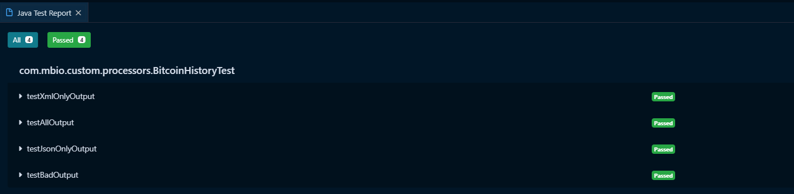

# Kaggle Bitcoin History data processor

## BitcoinHistoryProcessor - 3

### processor source 구조

기본적으로 mvn archetype을 이용해 프로세서를 생성하면 아래와 같은 형태로 processor가 생성됩니다.

```java
@Tags({"example"})
@CapabilityDescription("Provide a description")
@SeeAlso({})
@ReadsAttributes({@ReadsAttribute(attribute="", description="")})
@WritesAttributes({@WritesAttribute(attribute="", description="")})
public class BitcoinHistory extends AbstractProcessor {

    public static final PropertyDescriptor MY_PROPERTY = new PropertyDescriptor
            .Builder().name("MY_PROPERTY")
            .displayName("My property")
            .description("Example Property")
            .required(true)
            .addValidator(StandardValidators.NON_EMPTY_VALIDATOR)
            .build();

    public static final Relationship MY_RELATIONSHIP = new Relationship.Builder()
            .name("MY_RELATIONSHIP")
            .description("Example relationship")
            .build();

    private List<PropertyDescriptor> descriptors;

    private Set<Relationship> relationships;

    @Override
    protected void init(final ProcessorInitializationContext context) {
        final List<PropertyDescriptor> descriptors = new ArrayList<PropertyDescriptor>();
        descriptors.add(MY_PROPERTY);
        this.descriptors = Collections.unmodifiableList(descriptors);

        final Set<Relationship> relationships = new HashSet<Relationship>();
        relationships.add(MY_RELATIONSHIP);
        this.relationships = Collections.unmodifiableSet(relationships);
    }

    @Override
    public Set<Relationship> getRelationships() {
        return this.relationships;
    }

    @Override
    public final List<PropertyDescriptor> getSupportedPropertyDescriptors() {
        return descriptors;
    }

    @OnScheduled
    public void onScheduled(final ProcessContext context) {

    }

    @Override
    public void onTrigger(final ProcessContext context, final ProcessSession session) throws ProcessException {
        FlowFile flowFile = session.get();
        if ( flowFile == null ) {
            return;
        }
        // TODO implement
    }
```
  
class에 여러 annotation이 정의되어있는것을 볼 수 있습니다.  
nifi는 다양한 annotation을 제공하여 개발 편의성이 높습니다.  
processor의 input을 강제할수도 있고, ReadsAttributes 와 WritesAttributes 어노테이션을 작성하면 view usage에서 자동으로 프로세서의 참고 문서를 작성해줍니다.

:::tip
모든 프로세서는 AbstractProcessor를 상속받아서 동작합니다.
AbstractProcessor에서 정의한 init, getRelationships, getSupportedPropertyDescriptors, onTrigger등을 override하여 thread 핸들링에 대한 큰 고민없이 편하게 개발할 수 있습니다.
:::

getRelationships 을 통해 processor relation을 정의하고,  
getSupportedPropertyDescriptors을 통해 property를 정의합니다.

init method는 nifi에서 processor가 생성될때 단 한번만 호출되어, 초기화 메소드를 작성하기에 좋습니다.

@OnScheduled annotation이 붙은 onScheduled 메소드는 프로세서를 시작할때 한번 호출됩니다.

onTrigger method는 processor가 실행될때마다 호출되는 메소드 입니다.  
nifi는 프로세서의 실행 시간을 사용자가 ui로 지정할 수 있어, 해당 실행시점마다 호출되는 메소드입니다.  

이외에도 프로세스 정지 시점에 호출되는 메소드 등 lifecycle마다 동작을 정의할 수 있습니다.

:::warning
추가로 nifi에서는 Concurrent Tasks옵션을 통해 실행 시점마다 몇개의 thread를 사용하여 실행할 것인지 지정할 수 있습니다.  
이 때문에 onTrigger 메소드는 동시에 여러개의 thread가 호출 할수 있기 때문에 항상 thread safe하게 코딩해야합니다.  
:::


### relation & property 정의

이제 본격적으로 processor를 만들기 위해 processor의 relation과 property를 정의합니다.

input으로 들어온 flowfile을 처리하고 성공 실패시 flowfile을 어느쪽으로 보낼지, processor의 동작을 어떻게 처리할 지에 대한 property를 정의하는 것입니다.

위의 소스 구조에서 relation과 property를 작성하면 소스가 너무 길어지기 때문에 이부분은 별도 class로 구분하여 작성하겠습니다.

아래와 같이 ConfigUtil enum class를 작성합니다.

```java

public enum ConfigUtil {

  INSTANCE;

  private static List<PropertyDescriptor> properties;
  private static Set<Relationship> relationships;

  public static final String JSON_RECORDS = "JSON records created";
  public static final String XML_RECORDS = "XML records created";
  public static final String RECORDS_READ = "CSV records read";

  public static final String JSON_MIME_TYPE = "application/json";
  public static final String XML_MIME_TYPE = "text/xml";

  public static final PropertyDescriptor OUTPUT = new PropertyDescriptor.Builder().name("output")
      .displayName("Output format").description("Format of output FlowFiles")
      .allowableValues("XML", "JSON", "ALL").defaultValue("ALL")
      .addValidator(StandardValidators.NON_EMPTY_VALIDATOR).required(true).build();
  
  public static final Relationship XML =
      new Relationship.Builder().name("xml").description("Files process as JSON successfully routed here").build();

  public static final Relationship JSON =
      new Relationship.Builder().name("json").description("Files process as XML successfully routed here").build();
  
  public static final Relationship FAILURE =
      new Relationship.Builder().name("failure").description("Files routed here after processing failure").build();
  
  static {
    List<PropertyDescriptor> properties = new ArrayList<>();
    properties.add(OUTPUT);
    ConfigUtil.properties = Collections.unmodifiableList(properties);
    
    Set<Relationship> relationships = new HashSet<>();
    relationships.add(JSON);
    relationships.add(XML);
    relationships.add(FAILURE);
    ConfigUtil.relationships = Collections.unmodifiableSet(relationships);
  }
  
  public static List<PropertyDescriptor> getProperties(){
    return properties;
  }
  
  public static Set<Relationship> getRelaltionships(){
    return relationships;
  }
  
}

```

relation으로 xml과 json 그리고 실패시 flowfile을 이동시키기위한 failure를 정의합니다.
property로는 xml,json 혹은 둘다 어떤 포맷으로 변경할 것인지를 선택하기위한 옵션을 정의해줍니다.

relation과 property를 정의했으니 이제 BitcoinHistory에서 정의해줍니다.  
아래처럼 당장 사용하지 않을 annotation을 제거하고, Input이 반드시 필요하기 때문에 @InputRequirement 어노테이션을 추가로 정의합니다.

```java
@Tags({"Bitcoin", "JSON", "XML", "CSV"})
@CapabilityDescription("Process Bitcoin transactions into XML or JSON format or both")
@InputRequirement(Requirement.INPUT_REQUIRED)
public class BitcoinHistory extends AbstractProcessor {

    @Override
    public Set<Relationship> getRelationships() {
        return ConfigUtil.getRelaltionships();
    }

    @Override
    public final List<PropertyDescriptor> getSupportedPropertyDescriptors() {
        return ConfigUtil.getProperties();
    }

    @OnScheduled
    public void onScheduled(final ProcessContext context) {

    }

    @Override
    public void onTrigger(final ProcessContext context, final ProcessSession session) throws ProcessException {
        FlowFile flowFile = session.get();
        if ( flowFile == null ) {
            return;
        }
        // TODO implement
    }
}
```

### flowfile의 conent를 읽어서 객체화하고 xml과 json으로 변환하여 내보내기

이제 실제 로직부분을 작성합니다.

아래와 같이 BitcoinHistory를 작성합니다.

  
<details><summary>BitcoinHistory</summary>
<p>

```java

import java.io.BufferedReader;
import java.io.BufferedWriter;
import java.io.IOException;
import java.io.InputStream;
import java.io.InputStreamReader;
import java.io.OutputStream;
import java.io.OutputStreamWriter;
import java.time.Instant;
import java.time.ZoneId;
import java.time.ZonedDateTime;
import java.util.List;
import java.util.Map;
import java.util.Set;
import java.util.concurrent.ConcurrentHashMap;
import java.util.concurrent.atomic.AtomicBoolean;
import java.util.concurrent.atomic.AtomicInteger;
import java.util.concurrent.atomic.AtomicReference;

import javax.xml.bind.JAXBContext;
import javax.xml.bind.JAXBException;
import javax.xml.bind.Marshaller;

import com.fasterxml.jackson.databind.ObjectMapper;
import com.fasterxml.jackson.databind.SerializationFeature;
import com.fasterxml.jackson.datatype.jsr310.JavaTimeModule;
import com.mbio.custom.processors.model.BitcoinHistoryModel;

import org.apache.commons.csv.CSVFormat;
import org.apache.commons.csv.CSVRecord;
import org.apache.nifi.annotation.behavior.InputRequirement;
import org.apache.nifi.annotation.behavior.InputRequirement.Requirement;
import org.apache.nifi.annotation.documentation.CapabilityDescription;
import org.apache.nifi.annotation.documentation.Tags;
import org.apache.nifi.annotation.lifecycle.OnScheduled;
import org.apache.nifi.components.PropertyDescriptor;
import org.apache.nifi.flowfile.FlowFile;
import org.apache.nifi.flowfile.attributes.CoreAttributes;
import org.apache.nifi.processor.AbstractProcessor;
import org.apache.nifi.processor.ProcessContext;
import org.apache.nifi.processor.ProcessSession;
import org.apache.nifi.processor.Relationship;
import org.apache.nifi.processor.exception.ProcessException;
import org.apache.nifi.processor.io.InputStreamCallback;
import org.apache.nifi.processor.io.OutputStreamCallback;

@Tags({ "Bitcoin", "JSON", "XML", "CSV" })
@CapabilityDescription("Process Bitcoin transactions into XML or JSON format or both")
@InputRequirement(Requirement.INPUT_REQUIRED)
public class BitcoinHistory extends AbstractProcessor {

    private enum Output {
        ALL, JSON, XML, DB
    };

    private static ObjectMapper mapper = new ObjectMapper();
    private AtomicReference<JAXBContext> jaxb = new AtomicReference<>();

    private AtomicReference<Output> output = new AtomicReference<>();

    @Override
    public Set<Relationship> getRelationships() {
        return ConfigUtil.getRelaltionships();
    }

    @Override
    public final List<PropertyDescriptor> getSupportedPropertyDescriptors() {
        return ConfigUtil.getProperties();
    }

    @OnScheduled
    public void onScheduled(final ProcessContext context) {
        final String output = context.getProperty(ConfigUtil.OUTPUT).getValue();
        this.output.set(Output.valueOf(output));

        mapper = new ObjectMapper();
        mapper.registerModule(new JavaTimeModule());
        mapper.disable(SerializationFeature.WRITE_DATES_AS_TIMESTAMPS);
        mapper.enable(SerializationFeature.INDENT_OUTPUT);

        try {
            jaxb.set(JAXBContext.newInstance(BitcoinHistoryModel.class));
        } catch (Exception e) {
            getLogger().error("Could not create JAXB context", e);
        }
    }

    @Override
    public void onTrigger(final ProcessContext context, final ProcessSession session) throws ProcessException {
        FlowFile flowFile = session.get();
        if (flowFile == null) {
            return;
        }

        final AtomicInteger jsonCounter = new AtomicInteger();
        final AtomicInteger xmlCounter = new AtomicInteger();
        final AtomicInteger recordsCounter = new AtomicInteger();

        final Set<BitcoinHistoryModel> jsonRecords = ConcurrentHashMap.newKeySet();
        final Set<BitcoinHistoryModel> xmlRecords = ConcurrentHashMap.newKeySet();
        final AtomicBoolean success = new AtomicBoolean(Boolean.TRUE);

        session.read(flowFile, new InputStreamCallback() {
            @Override
            public void process(InputStream in) throws IOException {

                try (final BufferedReader reader = new BufferedReader(new InputStreamReader(in))) {

                    final Iterable<CSVRecord> records = CSVFormat.RFC4180.withFirstRecordAsHeader().parse(reader);

                    for (final CSVRecord record : records) {

                        recordsCounter.incrementAndGet();

                        if (isValid(record)) {
                            final BitcoinHistoryModel history = createModel(record);
                            if (isOutputJson()) {
                                jsonRecords.add(history);
                                
                            }

                            if (isOutputXml()) {
                                xmlRecords.add(history);
                            }

                        }
                    }
                } catch (Exception e) {
                    getLogger().error("Error Processing input", e);
                    success.set(Boolean.FALSE);
                }
            }
        });

        if (isOutputJson()) {
            writeJson(session, flowFile, jsonRecords, jsonCounter);
        }

        if (isOutputXml()) {
            writeXml(session, flowFile, xmlRecords, xmlCounter);
        }

        session.adjustCounter(ConfigUtil.RECORDS_READ, recordsCounter.get(), true);
        session.adjustCounter(ConfigUtil.JSON_RECORDS, jsonCounter.get(), true);
        session.adjustCounter(ConfigUtil.XML_RECORDS, xmlCounter.get(), true);

        if (!success.get()) {
            session.transfer(flowFile, ConfigUtil.FAILURE);
        } else {
            session.remove(flowFile);
        }

    }

    private void writeJson(final ProcessSession session, final FlowFile flowFile,
            final Set<BitcoinHistoryModel> jsonRecords, final AtomicInteger count) {

        for (final BitcoinHistoryModel history : jsonRecords) {
            final FlowFile createdFlowFile = session.create(flowFile);

            final FlowFile jsonFlowFile = session.write(createdFlowFile, new OutputStreamCallback() {

                @Override
                public void process(OutputStream out) throws IOException {
                    try (final BufferedWriter writer = new BufferedWriter(new OutputStreamWriter(out))) {
                        mapper.writeValue(writer, history);
                    } catch (Exception e) {
                        getLogger().error("Colud not write record to JSON: {}", new Object[] { history }, e);
                    }
                }
            });

            final Map<String, String> attrs = new ConcurrentHashMap<String, String>();
            final String fileName = getFilename(jsonFlowFile) + count.incrementAndGet() + ".json";
            attrs.put(CoreAttributes.FILENAME.key(), fileName);
            attrs.put(CoreAttributes.MIME_TYPE.key(), ConfigUtil.JSON_MIME_TYPE);
            attrs.put(ConfigUtil.JSON_RECORDS, String.valueOf(count));

            final FlowFile updatedFlowFile = session.putAllAttributes(jsonFlowFile, attrs);

            session.transfer(updatedFlowFile, ConfigUtil.JSON);
            getLogger().debug("Wrote {} to JSON", new Object[] { history });
        }

    }

    private void writeXml(final ProcessSession session, final FlowFile flowFile,
            final Set<BitcoinHistoryModel> xmlRecords, final AtomicInteger count) {
        for (final BitcoinHistoryModel history : xmlRecords) {
            final FlowFile createdFlowFile = session.create(flowFile);
            Marshaller marshaller;
            try {
                marshaller = jaxb.get().createMarshaller();
                marshaller.setProperty(Marshaller.JAXB_FORMATTED_OUTPUT, Boolean.TRUE);
                final FlowFile xmlFlowFile = session.write(createdFlowFile, new OutputStreamCallback() {

                    @Override
                    public void process(OutputStream out) throws IOException {
                        try (final BufferedWriter writer = new BufferedWriter(new OutputStreamWriter(out))) {
                            marshaller.marshal(history, writer);
                        } catch (Exception e) {
                            getLogger().error("Colud not write record to XML: {}", new Object[] { history }, e);
                        }
                    }
                });

                final Map<String, String> attrs = new ConcurrentHashMap<String, String>();
                final String fileName = getFilename(xmlFlowFile) + count.incrementAndGet() + ".xml";
                attrs.put(CoreAttributes.FILENAME.key(), fileName);
                attrs.put(CoreAttributes.MIME_TYPE.key(), ConfigUtil.XML_MIME_TYPE);
                attrs.put(ConfigUtil.XML_RECORDS, String.valueOf(count));

                final FlowFile updatedFlowFile = session.putAllAttributes(xmlFlowFile, attrs);

                session.transfer(updatedFlowFile, ConfigUtil.XML);
                getLogger().debug("Wrote {} to XML", new Object[] { history });
            } catch (JAXBException e) {
                getLogger().error("JAXBException");
                session.remove(flowFile);
            }
        }
    }

    private BitcoinHistoryModel createModel(final CSVRecord record) {
        final BitcoinHistoryModel history = new BitcoinHistoryModel();

        final long unixTimestamp = Long.parseLong(record.get("Timestamp"));
        final Instant instant = Instant.ofEpochSecond(unixTimestamp);
        final ZonedDateTime timestamp = ZonedDateTime.ofInstant(instant, ZoneId.systemDefault());

        final double open = Double.parseDouble(record.get("Open"));
        final double high = Double.parseDouble(record.get("High"));
        final double low = Double.parseDouble(record.get("Low"));
        final double close = Double.parseDouble(record.get("Close"));
        final double btcVolume = Double.parseDouble(record.get("Volume_(BTC)"));
        final double usdVolume = Double.parseDouble(record.get("Volume_(Currency)"));
        final double weightedPrice = Double.parseDouble(record.get("Weighted_Price"));

        history.setTimestamp(timestamp);
        history.setOpen(open);
        history.setHigh(high);
        history.setLow(low);
        history.setClose(close);
        history.setBtcVolume(btcVolume);
        history.setUsdVolume(usdVolume);
        history.setWeightedPrice(weightedPrice);

        return history;
    }

    private String getFilename(final FlowFile flowFile) {
        final String fileName = flowFile.getAttribute(CoreAttributes.FILENAME.key());
        return fileName.substring(0, fileName.lastIndexOf("."));
    }

    private boolean isValid(final CSVRecord record) {
        return !record.toString().contains("NaN");
    }

    private boolean isOutputJson() {
        return output.get() == Output.ALL || output.get() == Output.JSON;
    }

    private boolean isOutputXml() {
        return output.get() == Output.ALL || output.get() == Output.XML;
    }
}
```

</p>
</details>
  

### Junit test 작성

NiFi는 작성한 Custom Processor를 테스트하기 위한 Junit용 testRunner도 제공합니다.  
실제 배포 전에 동일한 환경에서 테스트를 할 수 있도록 cluster모드, thread safe 테스트를 위한 concurrent task 설정을 통한 테스트를 할 수 있습니다.

실제로 작성한 코드가 정상 동작하는지 아래처럼 JUnit 코드를 작성합니다.

<details><summary>BitcoinHistoryTest</summary>
<p>

```java
import java.nio.file.Path;
import java.nio.file.Paths;

import org.apache.nifi.util.TestRunner;
import org.apache.nifi.util.TestRunners;
import org.junit.Before;
import org.junit.Test;

public class BitcoinHistoryTest {
    private static final String TEST_FILE = "test.csv";
    private static final String BAD_TEST_FILE = "bad.csv";
    private TestRunner testRunner;

    private Path input;
    private Path badInput;

    @Before
    public void init() throws Exception {
        testRunner = TestRunners.newTestRunner(BitcoinHistory.class);
        input = Paths.get(ClassLoader.getSystemResource(TEST_FILE).toURI());
        badInput = Paths.get(ClassLoader.getSystemResource(BAD_TEST_FILE).toURI());
        testRunner.setClustered(true);
    }

    @Test
    public void testAllOutput() throws Exception {
      
      testRunner.enqueue(input);
      testRunner.setProperty(ConfigUtil.OUTPUT, "ALL");
      
      testRunner.run();
      
      testRunner.assertQueueEmpty();
      
      testRunner.assertTransferCount(ConfigUtil.JSON, 1);
      testRunner.assertTransferCount(ConfigUtil.XML, 1);
      testRunner.assertTransferCount(ConfigUtil.FAILURE, 0);
      
      testRunner.shutdown();
    }

    @Test
    public void testJsonOnlyOutput() throws Exception {
      
      testRunner.enqueue(input);
      testRunner.setProperty(ConfigUtil.OUTPUT, "JSON");
      
      testRunner.run();
      
      testRunner.assertQueueEmpty();
      
      testRunner.assertTransferCount(ConfigUtil.JSON, 1);
      testRunner.assertTransferCount(ConfigUtil.XML, 0);
      testRunner.assertTransferCount(ConfigUtil.FAILURE, 0);
      
      testRunner.shutdown();
    }

    @Test
    public void testXmlOnlyOutput() throws Exception {
      
      testRunner.enqueue(input);
      testRunner.setProperty(ConfigUtil.OUTPUT, "XML");
      
      testRunner.run();
      
      testRunner.assertQueueEmpty();
      
      testRunner.assertTransferCount(ConfigUtil.JSON, 0);
      testRunner.assertTransferCount(ConfigUtil.XML, 1);
      testRunner.assertTransferCount(ConfigUtil.FAILURE, 0);
      
      testRunner.shutdown();
    }

    @Test
    public void testBadOutput() throws Exception {
      
      testRunner.enqueue(badInput);
      testRunner.setClustered(true);
      testRunner.setProperty(ConfigUtil.OUTPUT, "XML");
      
      testRunner.run();
      
      testRunner.assertQueueEmpty();
      
      testRunner.assertTransferCount(ConfigUtil.JSON, 0);
      testRunner.assertTransferCount(ConfigUtil.XML, 0);
      testRunner.assertTransferCount(ConfigUtil.FAILURE, 1);
      
      testRunner.shutdown();
    }

}
```

</p>
</details>

아래처럼 Junit테스트가 성공하면 정상적으로 로직을 작성한 것입니다.



  
변경사항은 아래에서 확인할 수 있습니다.

https://github.com/qnwlqnwlxm/BitcoinHistoryProcessor/pull/4/files


전체소스는 아래 에서 다운로드 가능합니다.
https://github.com/qnwlqnwlxm/BitcoinHistoryProcessor/tree/kaggle-bitcoin-3