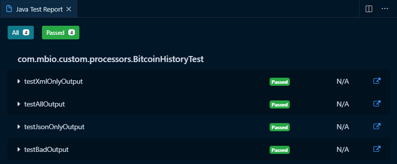
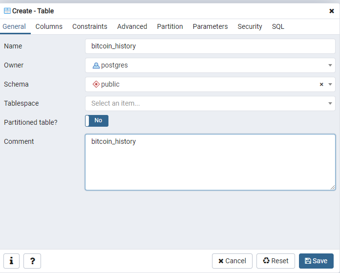
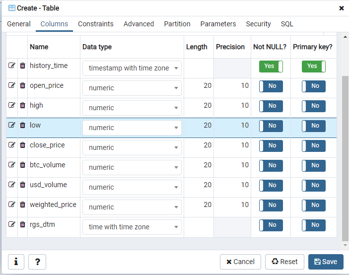
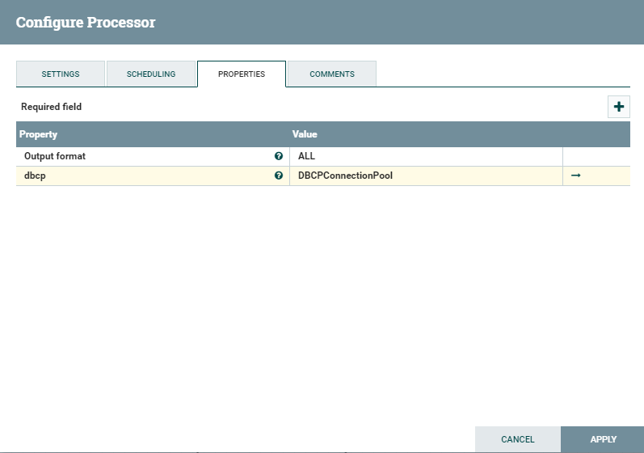
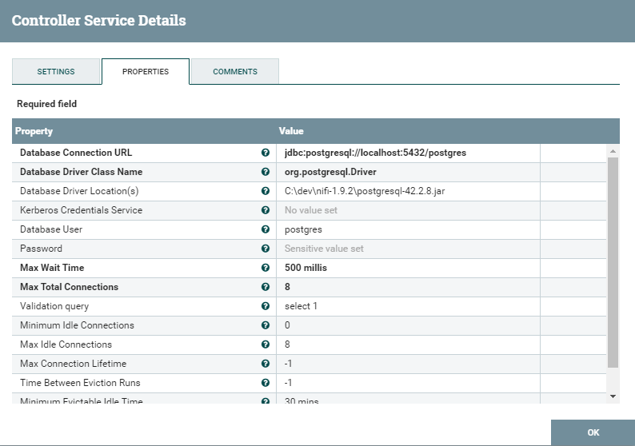
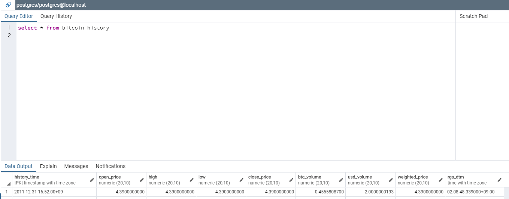

# Kaggle Bitcoin History data processor

## BitcoinHistoryProcessor - 4

### DBCP 서비스 dependency 추가 

이제 csv file을 읽어서 db에 insert 하는 로직을 추가해봅니다.

parent pom.xml에 아래 내용을 추가합니다.

properties에 version정보를 추가하고, dependency를 추가합니다.

test를 위한 derby db와 db connection pool 서비스를 쓰기위한정보입니다.

controller service를 사용하려면 nifi-BitcoinHistory-nar/pom.xml에 dependency도 추가해줘야합니다.

nifi-BitcoinHistory-nar/pom.xml
```xml
<dependency>
    <groupId>org.apache.nifi</groupId>
    <artifactId>nifi-dbcp-service-nar</artifactId>
    <version>1.9.2</version>
    <type>nar</type>
</dependency>

</project>
```

pom.xml

```xml
<!-- properties -->
<nifi.version>1.9.2</nifi.version>
<derby.version>10.14.2.0</derby.version>

    <dependency>
        <groupId>org.apache.derby</groupId>
        <artifactId>derbyclient</artifactId>
        <version>${derby.version}</version>
    </dependency>
    <dependency>
        <groupId>org.apache.derby</groupId>
        <artifactId>derbynet</artifactId>
        <version>${derby.version}</version>
    </dependency>

    <dependency>
        <groupId>org.apache.nifi</groupId>
        <artifactId>nifi-dbcp-service-api</artifactId>
        <version>${nifi.version}</version>
    </dependency>
    <dependency>
        <groupId>org.apache.nifi</groupId>
        <artifactId>nifi-dbcp-service</artifactId>
        <version>${nifi.version}</version>
        <scope>test</scope>
    </dependency>
```


nifi-BitcoinHistory-processors/pom.xml에는 아래 내용을추가합니다.
```xml
<dependency>
    <groupId>org.apache.nifi</groupId>
    <artifactId>nifi-dbcp-service-api</artifactId>
</dependency>
<dependency>
    <groupId>org.apache.nifi</groupId>
    <artifactId>nifi-dbcp-service</artifactId>
</dependency>
<dependency>
    <groupId>org.apache.derby</groupId>
    <artifactId>derbyclient</artifactId>
</dependency>
<dependency>
    <groupId>org.apache.derby</groupId>
    <artifactId>derbynet</artifactId>
</dependency>
``` 

### ConfigUtil 수정

이제 dbcp service를 사용해야 하기 때문에 property를 수정해줍니다.

```java
public static final PropertyDescriptor DS_PROP =
new PropertyDescriptor.Builder().name("dbcp").description("Database Connection Pool")
    .identifiesControllerService(DBCPService.class).required(true).build();

 List<PropertyDescriptor> properties = new ArrayList<>();
    properties.add(OUTPUT);
    properties.add(DS_PROP);
    ConfigUtil.properties = Collections.unmodifiableList(properties);
```

### BitcoinHistory processor 수정

OnScheduled 메소드에서 사용할 preparedStatement를 만들어줍니다.

```java
DBCPService dbcpService = context.getProperty(ConfigUtil.DS_PROP).asControllerService(DBCPService.class);
try {
    final PreparedStatement stmt = dbcpService.getConnection().prepareStatement(
            "insert into bitcoin_history (history_time, open_price, high, low, close_price, btc_volume, usd_volume, weighted_price, rgs_dtm) values (?,?,?,?,?,?,?,?,?)");
    this.stmt.set(stmt);
} catch (ProcessException | SQLException e) {
    getLogger().error("Could not create PreparedStatment", e);
}
```

아래처럼 db insert에 사용할 method를 추가합니다.

```java
    private void writeDb(final Set<BitcoinHistoryModel> dbRecords, final AtomicInteger count) {

        final PreparedStatement stmt = this.stmt.get();

        try {
          for (final BitcoinHistoryModel history : dbRecords) {
            stmt.setTimestamp(1, Timestamp.from(history.getTimestamp().toInstant()));
            stmt.setDouble(2, history.getOpen());
            stmt.setDouble(3, history.getHigh());
            stmt.setDouble(4, history.getLow());
            stmt.setDouble(5, history.getClose());
            stmt.setDouble(6, history.getBtcVolume());
            stmt.setDouble(7, history.getUsdVolume());
            stmt.setDouble(8, history.getWeightedPrice());
            stmt.setTimestamp(9, Timestamp.from(ZonedDateTime.now().toInstant()));
            stmt.execute();
            count.incrementAndGet();
            getLogger().debug("Wrote {} to DB", new Object[] {history});
          }
        } catch (Exception e) {
          getLogger().error("Could not insert into DB", e);
        }
      }
```

OnTrigger method에 db 처리부분을 추가합니다.

```java
session.read(flowFile, new InputStreamCallback() {
            @Override
            public void process(InputStream in) throws IOException {

                try (final BufferedReader reader = new BufferedReader(new InputStreamReader(in))) {

                    final Iterable<CSVRecord> records = CSVFormat.RFC4180.withFirstRecordAsHeader().parse(reader);

                    for (final CSVRecord record : records) {

                        recordsCounter.incrementAndGet();

                        if (isValid(record)) {
                            final BitcoinHistoryModel history = createModel(record);
                            if (isOutputJson()) {
                                jsonRecords.add(history);

                            }

                            if (isOutputXml()) {
                                xmlRecords.add(history);
                            }

                            if (isOutputDb()) {
                                dbRecords.add(history);
                            }

                        }
                    }
                } catch (Exception e) {
                    getLogger().error("Error Processing input", e);
                    success.set(Boolean.FALSE);
                }
            }
        });

if (isOutputDb()) {
    writeDb(dbRecords, dbCounter);
}

```


### Test Code 작성

정상적으로 db에 insert가 되는지 확인하기위해 junit code를작성합니다.

test를 위한 derby db를 셋업하고, table을 생성합니다.

```java
private static NetworkServerControl derby;
  final static String DB_LOCATION = "target/db";

  @BeforeClass
  public static void beforeClass() throws Exception {
    System.setProperty("derby.stream.error.file", "target/derby.log");
    derby = new NetworkServerControl();
    derby.start(new PrintWriter(System.out));
  }

  @AfterClass
  public static void stop() throws Exception {
    derby.shutdown();
  }

  @Before
  public void init() throws Exception {

    testRunner = TestRunners.newTestRunner(BitcoinHistory.class);
    input = Paths.get(ClassLoader.getSystemResource(TEST_FILE).toURI());
    badInput = Paths.get(ClassLoader.getSystemResource(BAD_TEST_FILE).toURI());
    testRunner.setClustered(true);

    final DBCPService dbcp = new DBCPServiceSimpleImpl();

    final Map<String, String> dbcpProperties = new HashMap<>();

    testRunner.addControllerService("dbcp", dbcp, dbcpProperties);
    testRunner.enableControllerService(dbcp);
    testRunner.setProperty(ConfigUtil.DS_PROP, "dbcp");

    final Connection con = ((DBCPService) testRunner.getControllerService("dbcp")).getConnection();
    Statement stmt = con.createStatement();
    try {
      stmt.execute("drop table bitcoin_history");
    } catch (final SQLException sqle) {
    }
    stmt.execute(
        "create table bitcoin_history (history_time timestamp not null, open_price decimal(20,10), high decimal(20,10), low decimal(20,10),"
        +"close_price decimal(20,10),btc_volume decimal(20,10),usd_volume decimal(20,10),weighted_price decimal(20,10),rgs_dtm timestamp,constraint my_pk primary key (history_time))");
  }

    class DBCPServiceSimpleImpl extends AbstractControllerService implements DBCPService {

    @Override
    public String getIdentifier() {
      return "dbcp";
    }

    @Override
    public Connection getConnection() throws ProcessException {
      try {
        Class.forName("org.apache.derby.jdbc.EmbeddedDriver");
        final Connection con = DriverManager.getConnection("jdbc:derby:" + DB_LOCATION + ";create=true");
        return con;
      } catch (final Exception e) {
        throw new ProcessException("getConnection failed: " + e);
      }
    }
  }
```

JUnit 테스트를 통해 정상처리되었는지 확인합니다.




NiFi에 배포 후에 테스트를 해서 db에 정상적으로 적재되었는지 확인합니다.

test를 위해 postgre sql에 table을 생성합니다.

:::tip
PostgreSQL 다운로드가 필요하신 분은 [PostgreSQL](https://www.postgresql.org/download/) 이곳에서 다운로드 가 가능합니다.
:::




NiFi에서 dbcp controller service설정을 해줍니다.




NiFi에서 flow를 실행시킨뒤 DB에 적재된 내용을 확인합니다.



여기까지 했으면 csv파일을 읽어서 xml, json 포맷변환, db적재까지 처리한 것입니다.
여러 processor를 통해 복잡하게 처리해야 했던것을 pojo클래스 하나만 잘만들면 쉽게 처리 할 수 있습니다. 

다음시간에는 default dbcp controller service 대신 요즘 핫한 hikari dbcp controller service를 제작해서 사용해봅니다.  

이후에 이번에 만든 custom processor를 hikari dbcp를 사용하도록 변경합니다.


변경사항은 아래에서 확인할 수 있습니다.

[https://github.com/qnwlqnwlxm/BitcoinHistoryProcessor/pull/5/files](https://github.com/qnwlqnwlxm/BitcoinHistoryProcessor/pull/5/files)


전체소스는 아래 에서 다운로드 가능합니다.
[https://github.com/qnwlqnwlxm/BitcoinHistoryProcessor/tree/kaggle-bitcoin-4](https://github.com/qnwlqnwlxm/BitcoinHistoryProcessor/tree/kaggle-bitcoin-4)