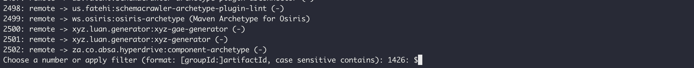
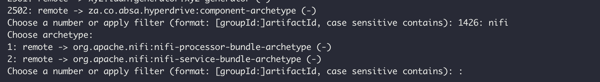
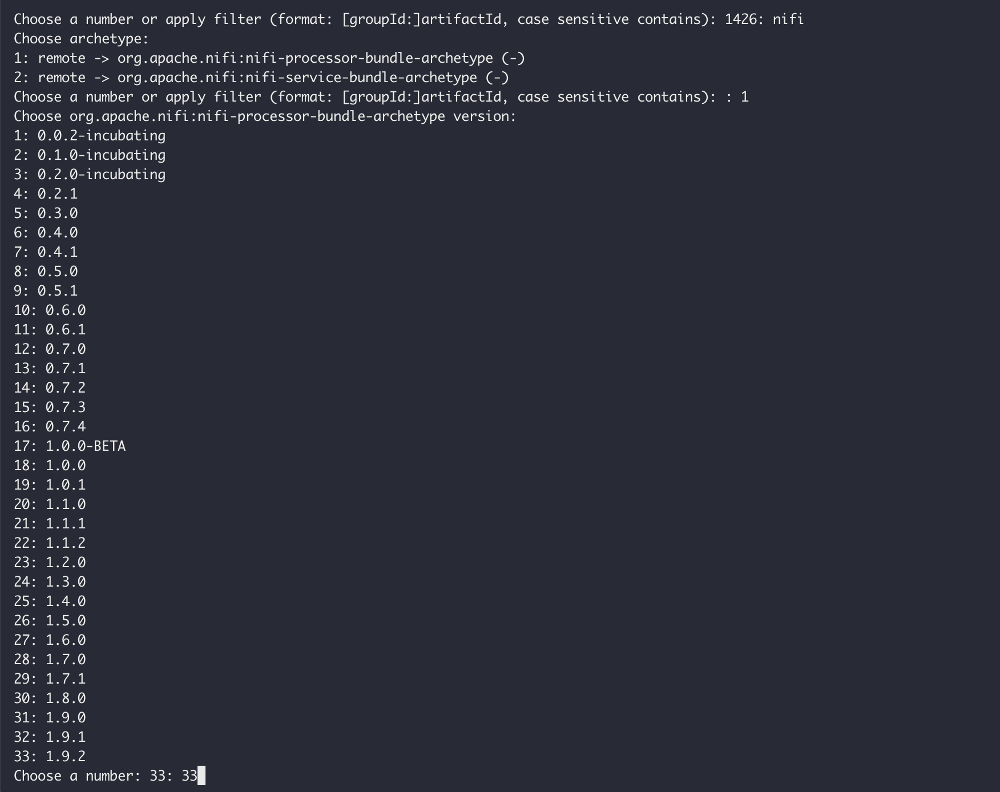
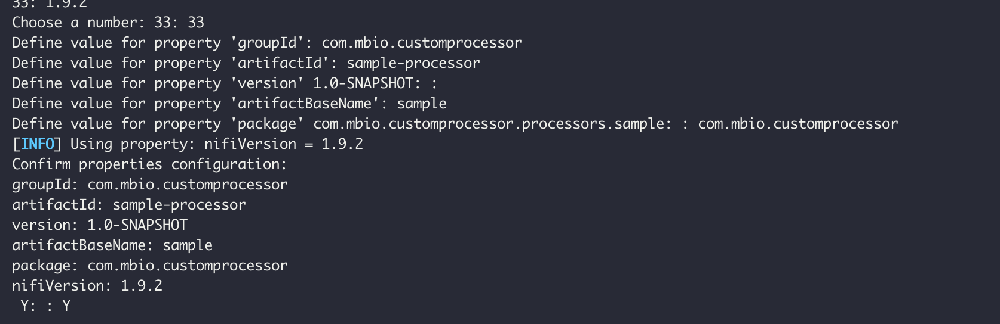
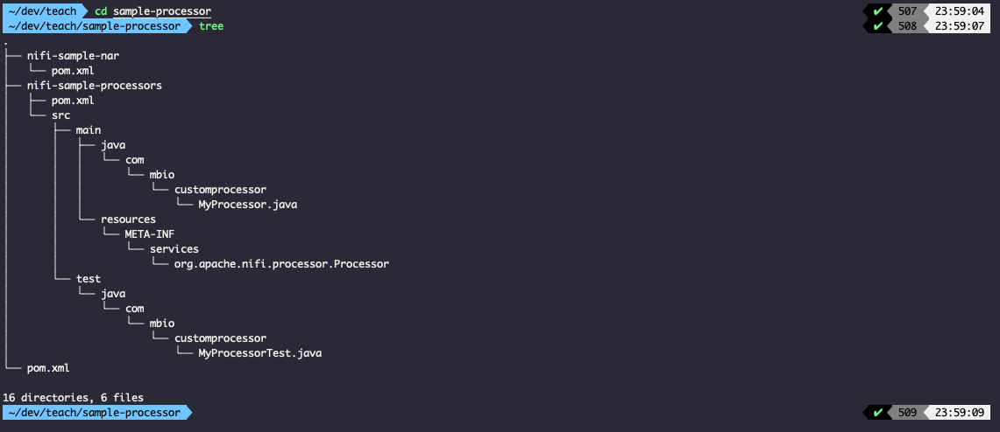
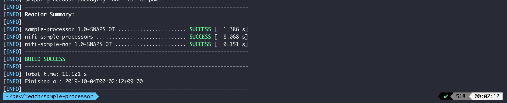
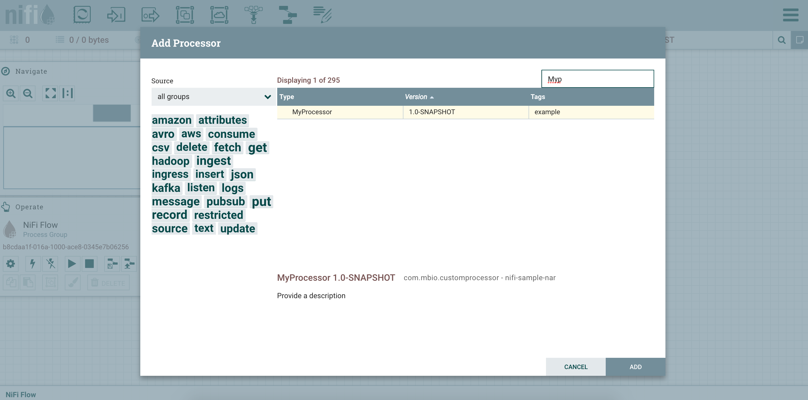

# NiFi Custom Processor 프로젝트 생성

## Step for creating Apache NiFi Custom Processor

### 1. Maven archetype을 통한 custom processor project 생성

NiFi는 Processor 생성을 위한 maven archetype을 제공합니다.

```bash{1}
mvn archetype:generate
```

위의 명령어를 치면 아래와 같은 화면이 표시됩니다.



### 2. mvn archetype list에서 nifi processor 프로젝트 선택

maven archetype list에서 filter를 nifi로 줍니다.


### 3. nifi 버전 선택

1.9.2버전을 기준으로 개발 예정이기 때문에 33번을 선택해줍니다.



:::tip
위의 과정은 아래 명령어로 한번에 해도됩니다.
mvn archetype:generate -DarchetypeGroupId=org.apache.nifi -DarchetypeArtifactId=nifi-processor-bundle-archetype -DarchetypeVersion=1.9.2 -DnifiVersion=1.9.2
:::

### 4. maven 프로젝트 속성 설정



### 5. 생성 완료된 nifi custom processor 구조

NiFi Custom Processor archetype 생성후 Tree구조


이제 첫 번째 MyProcessor가 생성되었습니다.

Nifi custom processor MAVEN project는 기본적으로 [multi-module-project](https://maven.apache.org/guides/mini/guide-multiple-modules.html)로 되어있습니다.

총 3개의 pom.xml이 생성되어 Project의 root에 parent pom.xml이 위치하고, 하위에 \*-processors 프로젝트, \*-nar 프로젝트에 각각 pom.xml이 생성됩니다..

processors 프로젝트에서 실질적인 로직을 작성하고, nar 프로젝트는 NiFi가 load할 수 있게 \*.nar 파일로 묶어주는 역할을 합니다.

### 6. maven build

프로젝트가 정상적으로 생성되었는지 확인을 위해 maven 빌드를 수행한다.

```bash{1}
mvn clean package
```



위처럼 BUILD SUCCESS가 표시되면 완료입니다.

### 7. NiFi에 Custom Processor 배포 및 NiFi 시작

이제 NiFi에 방금 빌드한 NiFi Processor를 추가하고 NiFi를 시작합니다.

```bash
cp nifi-sample-nar/target/nifi-sample-nar-1.0-SNAPSHOT.nar $NIFI_HOME/lib
sh $NIFI_HOME/bin/nifi.sh start
```

### 8. Custom Processor 배포 확인



위 그림처럼 MyProcessor가 보이면 배포 성공입니다.

축하합니다. 첫 번째 NiFi Custom Processor를 추가했습니다.
