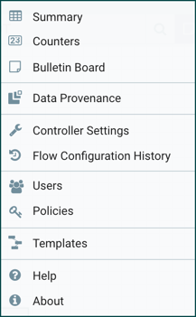

# Apache NiFi

[[toc]]

## Apache NiFi 소개

Apache NiFi는 NSA(National Security Agency)에서 Apache 재단에 기증한 Datalflow 엔진.  
특히 빅데이터 시스템처럼 전송경로가 복잡하고 실시간 처리가 중요한 곳에서 사용하기 좋은 솔루션.

## NiFi 핵심 Concept

NiFi의 핵심 디자인 컨셉은 Flow Based Programming(FBP)를 기본으로 함.  
Processor를 이용해 데이터의 수집,가공,변형을 여러 단계에 걸쳐서 할 수 있음.

### NiFi와 FBP 용어 비교

| NiFi Term          | FBP Term           | Description                                                                                                                                                         |
| ------------------ | ------------------ | ------------------------------------------------------------------------------------------------------------------------------------------------------------------- |
| FlowFile           | Information Packet | FlowFile은 NiFi에서 데이터를 표현하는 최소 단위. Key/Value 형태의 속성(Attribute)과 0바이트 이상의 데이터(Content)를 갖는다. FlowFile을 이용해 Dataflow를 구현한다. |
| FlowFile Processor | Black Box          | FlowFile은 프로세서를 통해 데이터 라우팅, 가공, 시스템간 이동을 할 수 있다. NiFi는 약 190여개에 이르는 기본 Processor를 제공한다.                                   |
| Connection         | Bounded Buffer     | 프로세서간의 연결을 말한다. NiFi의 Connection은 FlowFile의 queue뿐만 아니라 라우팅, 처리량 제한, 우선순위 제어, 모니터링 등의 여러 기능을 제공한다.                 |
| Flow Controller    | Scheduler          | 프로세서의 실행 시점을 관리한다.                                                                                                                                    |
| Process Group      | subnet             | 업무, 기능 단위로 여러 Processor를 하나의 그룹으로 묶어서 관리할 수 있고, input/output Port를 통해 프로세스 그룹간 이동이 가능하다.                                 |

## NiFi 아키텍처


NiFi는 JAVA기반으로 작성되어 host os의 JVM 머신 위에서 동작합니다.  
JVM 내에서 NiFi의 주요 구성요소는 다음과 같습니다.

### Web Server

HTTP 기반의 UI를 제공하고 API를 컨트롤하기 위한 Web Server

### Flow Controller

operationg의 핵심! Processor들의 스케쥴을 관리하고, Extension 실행에 필요한 스레드를 제공합니다.

## Extensions

NiFi는 다양한 종류의 Extensions을 제공합니다. 여기서 다룰 주제인 Processor와 Controller Service외에도 ReportingTask, FlowFilePrioritizer, AuthorityProvider 등이 있고, UI Extensions 개발도 가능합니다. Custom UI에는 Custom Processor UI, Content Viewers가 있습니다.

### FlowFile Repository

Write-Ahead Log로 FlowFile의 속성과 상태값을 추적 기록하는 저장소입니다. pluggable repository기 때문에 다른데서 복붙하면 똑같은 데이터를 볼 수 있습니다.

### Content Repository

Pluggable Repo입니다. FlowFile의 실제 Content bytes가 저장된 위치입니다. 여러 디스크에 분산 저장이 가능합니다.(실제로 이런 경우는 거의 없을듯..) Content는 무겁기 때문에 NiFi 가 FlowFile을 다룰 때 실제 Content는 메모리에 로딩하지 않고, 참조값(disk의 file path)만 가지게 됩니다.

### Provenance Repository

Pluggable Repo입니다. 모든 FlowFile의 변경사항을 기록합니다. 여러 물리 disk volumes에 저장될수 있습니다. 각각의 위치는 인덱스 되어 저장되어 검색가능합니다. Apache 프로젝트니까 인덱싱에 [Apache lucene](https://lucene.apache.org/)을 사용합니다.

## NiFi Cluster 아키텍처


NiFi는 위의 그림처럼 cluster 환경으로 동작가능합니다.

NiFi 1.0 Release 부터 Zero-Master Clustering 패러다임이 적용되어 Apache Zookeeper에 의해 Cluster Coordinator와 Primary Node가 선출됩니다.
Primary Node는 단일 노드에서 Processor 실행을 원할 경우 사용되는 노드입니다.  
Cluster Coordinator는 모든 노드로부터 heartbeat와 상태정보를 받고 노드의 상태에 따라 연결을 관리합니다.

Cluster의 변경사항은 모든 Node에 복제되어 각 노드는 같은 Dataflow를 가지고 있기 때문에 어느 노드의 Web UI에 접속하든 동일하게 Dataflow를 제어 할 수 있습니다.

## NiFi local 설치 및 실행

### NiFi download

[NiFi download page](https://nifi.apache.org/download.html)  
위의 주소에 접속하여 nifi-1.9.2-bin.tar.gz 또는 zip파일을 받습니다.

다운로드 받은 파일의 압축을 해제하면 다음과 같은 폴더가 있습니다.  


### NiFi 실행


#### For Windows

cmd 또는 PowerShell 또는 Double Click을 통해 run-nifi.bat 파일 실행

#### For linux

```bash{1}
sh nifi.sh start
```

아무런 설정 없이 NiFi 실행시 conf디렉토리의 nifi.properties에 설정된 값에 따라 http://localhost:8080/nifi 를 통해 접속할 수 있습니다. PC환경에 따라 30sec ~ 5min까지 소요될 수 있습니다. 답답하시면 /logs폴더에 nifi-app.log를 확인하시면 아래와 같은 로그가 보인 경우 구동된 것입니다.

NiFi has started. The UI is available at the following URLs:


## NiFi Web UI 구성요소


NiFi Web UI에 접속하면 위와 같은 화면을 볼 수 있습니다.

### Components Toolbar

NiFi에서 사용하는 주요 컴포넌트 들이 있습니다. 해당 컴포넌트를 Drag&Drop하여 캔버스에 등록할 수 있습니다.

### Global Menu

아래 그림과 같은 메뉴로 구성 되어 있습니다.  


- summary : NiFi에 등록된 전체 컴포넌트 요약 정보 및 검색기능
- Counter : Processor에서 발생시키는 카운트 정보 제공
- Bulletin Board : 에러로그 등 시스템의 문제를 볼 수 있는 게시판 기능
- Data Provenanace : FlowFile의 변경사항 검색 기능
- Controller Settings : Processor의 실행을 담당하는 Timer Driven Thread Count수, Reporting Task 관리, NiFi Registry 연결 정보 관리 기능
- Flow Configuration History : Dataflow의 변경 이력 정보 제공. Dataflow 변경으로 장애 발생 시 해당 시간대 변경 이력을 추적할 수 있습니다.
- Users, Policies : 사용자 및 권한 관리, NiFi는 SSL인증서 기반의 인증을 제공하는데, 인증 기능이 활성화 된 경우에만 메뉴가 노출 됩니다.
- Templates : Dataflow를 설정 정보까지 유지한체 Template화 할 수 있습니다. NiFi Registry 미 설정 시 Template 기능을 이용해 Dataflow 복사, 이동, 이력관리를 할 수 있습니다.
- Help : Apache NiFi 홈페이지의 Docs와 동일한 정보를 제공합니다. Custom Processor 작성시 Help에 자동으로 추가됩니다
- About : NiFi의 Version 정보 제공

::: danger
한번 더 강조합니다. Users, Policies 메뉴는 인증 기능을 활성화한 경우에만 표시되고, 인증 기능을 활성화 하려면 반드시 SSL설정을 해야합니다.
:::

### Status Bar

NiFi의 간단 dashboard. 실행되고 있는 thread개수, bytes, processor 개수 오류정보, 클러스터 노드 정보 등을 제공합니다.

### Search

NiFi 캔버스에 등록되어 있는 Processor와 Connection 검색기능을 제공합니다.

::: tip
NiFi에 등록된 Processor가 너무 많은 경우, 매우 느립니다...
:::

### Operate Palette

NiFi components의 configure, Enable/Disable, Start/Stop, copy/paste, Processo Group 설정, 컴포넌트 색 변경, 삭제 등의 기능을 제공합니다. component 선택 시, context에 따라 버튼이 활성화/비활성화 됩니다.
