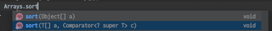

# CHAPTER04. 기본 알고리즘 작성하기

[[toc]]

## 빅 오 표현법 살펴보기

### 빅 오

### 빅오 개요

- 알고리즘의 성능을 수학적으로 표현해주는 표현법
- 시간, 공간 복잡도를 표현 (점근표기법 종류 - 빅오, 빅오메가, 빅세타 표기법)
  - 빅오 : 알고리즘 효율성을 상한선 기준으로 표시
  - 빅오메가 : 알고리즘 효율성을 하한선 기준으로 표시
  - 빅세타 : 상한선과 하한선의 사이를 기준으로 표시
- 실제 러닝타임보다는 데이터, 사용자의 증가에 따른 알고리즘의 성능 예측
- 상수는 무조건 1

### 빅오 표현법 특징

- 상수 무시
  - O(2n) = O(n)
  - 언제나 고정된 숫자만큼만 영향미침. 차원에 영향을 주지 않는한 버리면됨.

- 영향력 없는 항 무시
  - O(N^2 + N + 1) = O(N^2)
  - 입력값의 크기에 따라가기 때문에 가장 높은 차원이 아닌 항은 의미가 없으니까 버린다.

### 빅오 표현법 주요 함수 성능비교


- O(1) : 인자의 크기에 상관없이 언제나 일정한 속도
  - 대표 : stack push, pop
- O(n) : linear time
  - 입력 데이터의 크기에 비례해서 처리 시간이 소요됨.
  - for문 1개
- O(n^2) : quadratic time
  - for문 두개 (with n), 삽입정렬, 버블 정렬, 선택정렬
- O(nm) : quadratic time
  - for문 두개(with n, m), 근데 n과 m의 크기 차이가 날수 있음. 하지만 데이터 증가에 따른 시간 상승은 O(N^2)과 똑같
- O(n^3) : polynomial / cubic time
  - for문 3개(with n), 그래프는 비슷한뎅 시간이급격하게 상승함.
- O(2^n) : exponential time
  - 피보나치, 트리의 높이만큼 반복, O(n^3)보다 급격하게 시간 상승
- O(m^n) : exponential time
- O(log n) 
  - 처리 진행마다 처리대상이 반씩 줄어드는 경우
  - binary search, 퀵정렬, 병합 정렬, 힙정렬
- O(sqrt(n))

## 리스트 정렬하기

### Q1. Comparable과 Comparator 인터페이스의 차이는 무엇인가

- Comparable
  - 정렬 수행 시 기본적으로 적용되는 정렬 기준이 되는 메소드를 정의하는 인터페이스
- Comparator
  - 정렬 규칙 그 자체를 의미. 기본 정렬과 다르게 원하는데로 정렬 기준을 만들고 싶을 때 사용하는 인터페이스

아래처럼 Arrays, Collections의 Sort method를 살펴보면 2번째 인자로 Comparator interface 구현체를 받는 메소드가 별도로 있다.




인자가 1개인 sort는 Comparable interface의 compareTo method를 실행해 정렬
Comparator 인터페이스 구현체를 인자로 받는 sort 메소드는 Comparator interface의 compare method를 실행해 정렬한다.

### Q2. 버블 정렬 구현
  
- 가장 단순한 정렬 방식, 앞에서 부터 2개씩 값비교로 정렬하는 방식
- 끝까지 순회하면 마지막 요소는 정렬이 된것, 다시 순회하면 마지막 요소 -1 번째 요소가 정렬이 됨.
- 이런식으로 맨 처음 요소가 정렬될 때까지 반복하면 전체 요소가 정렬됨
- 요소 전체의 갯수만큼, 각 요소의 n번째, n+1번째 요소를 비교해야해서 O(N^2)가 됨.

``` java
  @Test
    public void bubbleSortTest(){
        int [] numbers = {253, 3, 5, 14, 145, 434, 343, 125, 667, 876, 345, 8634,1,45,523,12,42,456};
        int [] expects = {1, 3, 5, 12, 14, 42, 45, 125, 145, 253, 343, 345, 434, 456, 523, 667, 876, 8634 };
        for(int i=0;i<numbers.length;i++){
            for(int j=0; j < numbers.length-i-1; j++){
                //가장 마지막 요소는 정렬이 된 상태기 때문에 제외
                if(numbers[j]>numbers[j+1]) {
                    numbers[j] = numbers[j] ^ numbers[j+1];
                    numbers[j+1] = numbers[j] ^ numbers[j+1];
                    numbers[j] = numbers[j] ^ numbers[j+1];
                }
            }
        }
      assertArrayEquals(expects, numbers);
  }
```

### Q3. 삽입 정렬 구현

- 정렬된 새로운 array를 유지하면서 한 개씩 삽입 하면서 정렬
- 한칸 늘릴 때 새로 삽입된 데이터를 정렬된 어레이의 맞는 자리로 위치시킴
- 최악의 경우(정렬된 것) O(N^2), 최선의 경우(역순으로정렬) O(N)인 알고리즘
- 새로운 List에 특정 위치에 계속 삽입을 해야되기 때문에 ArrayList보다 LinkedList가 효율적

```java
  @Test
  public void insertSortTest(){
      List<Integer> numbers = new LinkedList<>();
      numbers.add(0,4);
      numbers.add(1,3);
      numbers.add(2,6);
      numbers.add(3,1);
      numbers.add(4,2);
      numbers.add(5,5);

      List<Integer> expects = new LinkedList<>();
      for(int i=0;i<6;i++){
          expects.add(i,i+1);
      }
      Assert.assertEquals(expects, insertSort(numbers));
  }

  public static List<Integer> insertSort(final List<Integer> numbers){
      final List<Integer> sortedList = new LinkedList<>();

      originalList : for(Integer number: numbers){
          for(int i=0;i<sortedList.size();i++){
              if(number < sortedList.get(i)){
                  sortedList.add(i,number);
                  continue originalList;
              } //역순 정렬의 경우 첫번째 비교후 삽입하고
                // 바로 outer for문으로 이동함
          }
          sortedList.add(sortedList.size(),number);
      }
      return sortedList;
  }
```

### Q4. 퀵 정렬 구현

- 분할정복 (divide and conquer) 알고리즘
- 정렬이 안된 배열이 있으면 기준을 아무거나 잡고, 작은건 왼쪽에 아닌건 오른쪽에 넣음.
- 그래서 왼쪽따로 정렬하고 오른쪽 따로 정렬하면 정렬끝남
- 왼쪽에서 다시 기준을 아무거나 잡고 왼쪽, 오른쪽 다시 정렬
- 계속 쪼개다보면 파티션에 딱 2개만 남게되면 1개로 쪼개지고 정렬이됨.
- 이렇게 쪼개진 모든 파티션이 정렬되고, 정렬된 배열을 리턴하기 때문에 끝나면 정렬된 배열이 나옴
- 평균은 O(N log N). 최악은 역시 O(N^2)
- 선택한 값이 가장 작거나, 가장 큰값만 선택되는 경우에 최악의 경우가 되는데, 확률적으로 이럴 경우가 거의 없기 때문에 실제로 최악의 성능이 나오는 경우는 거의 없음. 그래서 퀵정렬 시간 복잡도 얘기하면 보통 O(N log N)이라고 함
- 파티션을 나누는 횟수는 N번, 두번째 나눌때는 N을 둘로 나눈 결과로 나누는 거기 때문에 검색할 데이터가 반으로 줄어듬 그래서 O(N log N)

```java
    @Test
    public void quickSortTest(){
        List<Integer> numbers = new LinkedList<>();
        numbers.add(0,4);
        numbers.add(1,3);
        numbers.add(2,6);
        numbers.add(3,1);
        numbers.add(4,2);
        numbers.add(5,5);

        List<Integer> expects = new LinkedList<>();
        for(int i=0;i<6;i++){
            expects.add(i,i+1);
        }
        Assert.assertEquals(expects, insertSort(numbers));
    }

    public static List<Integer> quickSort(List<Integer> numbers){
      if(numbers.size() < 2){
          return numbers;
      }

      final Integer pivot = numbers.get(0);
      final List<Integer> lower = new ArrayList<>();
      final List<Integer> higher = new ArrayList<>();

      for(int i=1;i<numbers.size();i++){
          if(numbers.get(i) < pivot){
              lower.add(numbers.get(i));
          }else {
              higher.add(numbers.get(i));
          }
      }

      final List<Integer> sorted = quickSort(lower);
      sorted.add(pivot);
      sorted.addAll(quickSort(higher));

      return sorted;
    }
```

### Q5. 병합 정렬 구현

- 분할정복 (divide and conquer) 알고리즘
- 리스트를 두개로 나우고 각 하위 리스틀 정렬한 후 각각을 하나로 합친다.
- 배열을 둘로 나누고, 남은걸 다시 둘로 나누고 반복해서 2개만 남았을때부터 정렬함.
- n개만큼씩 log n번 돌기 때문에 O(n log n)이 됨. 파티션이 무조건 반으로 쪼개지기 때문
- 최악 O(n log n) 퀵소트에서 pivot 잘골랐을때랑 비슷함

```java
  @Test
  public void mergeSortTest() {
    List<Integer> numbers = new LinkedList<>();
    numbers.add(0, 4);
    numbers.add(1, 3);
    numbers.add(2, 6);
    numbers.add(3, 1);
    numbers.add(4, 2);
    numbers.add(5, 5);

    List<Integer> expects = new LinkedList<>();
    for (int i = 0; i < 6; i++) {
      expects.add(i, i + 1);
    }
    Assert.assertEquals(expects, mergeSort(numbers));
  }

  public static List<Integer> mergeSort(final List<Integer> numbers) {
    if (numbers.size() < 2) {
      return numbers;
    }

    final List<Integer> leftHalf = numbers.subList(0, numbers.size() / 2);
    final List<Integer> rightHalf = numbers.subList(numbers.size() / 2, numbers.size());

    return mergeSort(mergeSort(leftHalf), mergeSort(rightHalf));
  }

  public static List<Integer> mergeSort(final List<Integer> left, final List<Integer> right){
      int leftIdx = 0;
      int rightIdx = 0;
      final List<Integer> merged = new ArrayList<>(left.size()+right.size());

      while(leftIdx < left.size() && rightIdx < right.size()){
          if(left.get(leftIdx) < right.get(rightIdx)){
              merged.add(left.get(leftIdx));
              leftIdx++;
          } else {
              merged.add(right.get(rightIdx));
              rightIdx++;
          }
      }

      while (leftIdx < left.size()){
          merged.add(left.get(leftIdx));
          leftIdx++;
      }

      while (rightIdx < right.size()){
          merged.add(right.get(rightIdx));
          rightIdx++;
      }

      return merged;
  }
```

## 리스트 검색하기

### Q6. 이진 검색 구현

- 이미 정렬된 리스트가 있는 경우 binary search를 사용하면 검색이 효율적
- divide and conquer 알고리즘
- 이미 정렬이 되어 있고, 찾을 대상이 반으로 계속 줄기 때문에 O(log N)이다

```java
@Test
  public void binarySearchTest() {
    List<Integer> numbers = new LinkedList<>();
    for (int i = 0; i < 10000; i++) {
      numbers.add(i, i + 1);
    }
    System.out.println(numbers);
    int target = 1000;
    Integer expected = 999;
    Assert.assertEquals(expected, binarySearch(numbers, target));
  }

  public static Integer binarySearch(final List<Integer> numbers, final Integer target) {
    //리스트의 위치값 반환
    if (numbers == null || numbers.isEmpty()) {
      return -1;
      // 비어 있는 경우 -1 반환
    }

    int first = 0;
    int last = numbers.size() - 1;
    int mid = 0;
    while (first <= last) {
      mid = (first + last) / 2;
        if (numbers.get(mid) < target) {
            first = mid + 1;
        } else if (numbers.get(mid) > target) {
            last = mid - 1;
        } else {
            return mid;
        }
    }

    return -1;
    //데이터 없는 경우 -1 반환
  }
```
