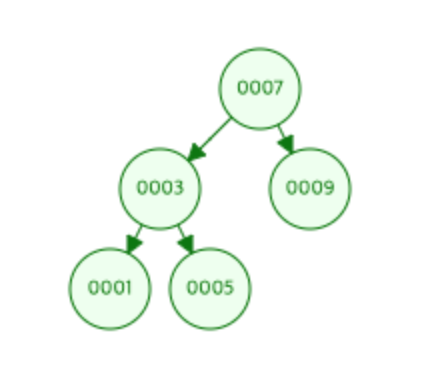
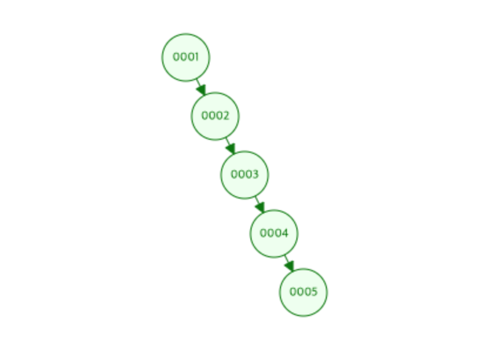
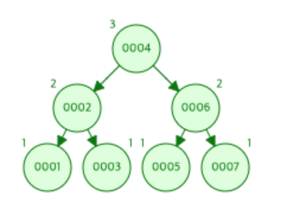
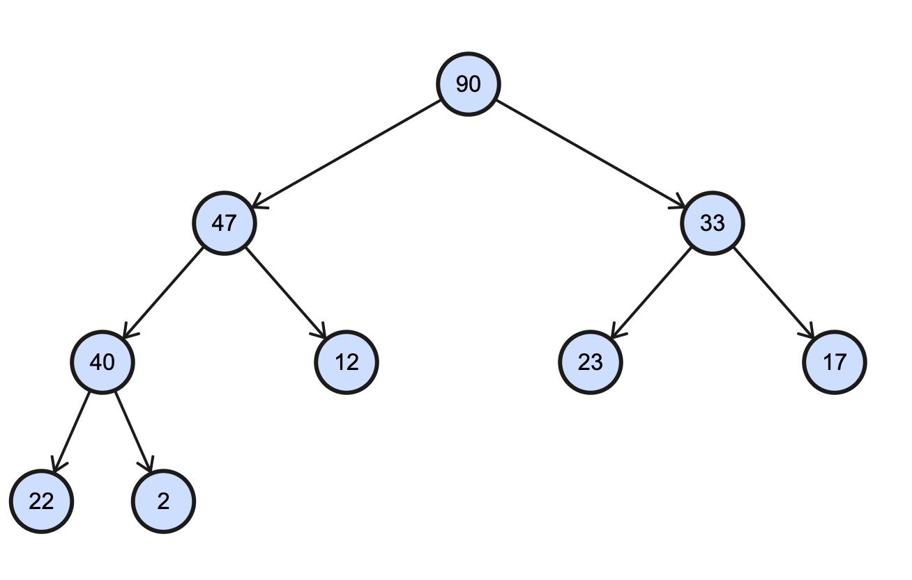
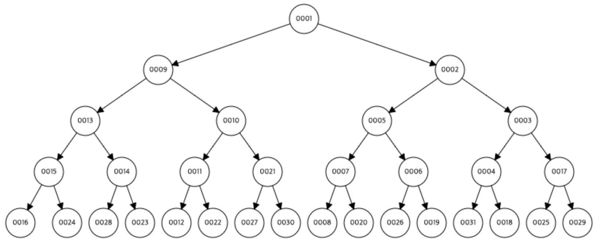
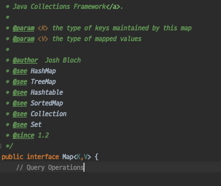

# CHAPTER05. 자료구조

[[toc]]

## 개요

- JAVA의 자료구조 모음 Collection API
- 1.2에서 추가되었고 Josh Bloch, Neal Gafter 작성
- JAVA의 컬렉션 API 구현체 목록

 1. Set
 1. List
 1. Map
 1. SortedSet
 1. SortedMap
 1. HashSet
 1. TreeSet
 1. ArrayList
 1. LinkedList
 1. Vector
 1. Collections
 1. Arrays
 1. AbstractCollection

## 리스트

### 리스트란

- 특정 타입 값들이 순차적으로 정렬된 컬렉션
- 대표적인 리스트구현체로는 ArrayList, LinkedList, Vector가 있음
- Vector는 Collection API 등장 전에 만들어진 ArrayList와 동일한 기능을 하는 클래스, 현재는 완전히 Collection 소속으로 포팅되었음.
- 대표적인 차이점으로 Vector는 Thread Safe하다.
- Thread Safe가 필요하면 지금은 Concurrent API에 CopyOnWriteArrayList 를 사용하고 Vector는 제거하면된다.
- 과거에 작성된 JAVA 와의 호환성을 위해 남겨놨을뿐

## 배열과 리스트의 관계

### 배열

- 배열은 대괄호를 이용하는 타입으로 구성된다
- 자바 배열 타입과 정의 방법

``` java
  @Test
  public void arrayDefinitions() {
    final int[] integers = new int[3]; //명시적 크기지정
    final boolean[] bools = {Boolean.TRUE, Boolean.FALSE, Boolean.TRUE, Boolean.FALSE}; // 암시적 크기지정
    final String[] strings = new String[] {"one","to"}; 

    final Random r = new Random();
    final String[] randomArrayLength = new String[r.nextInt(100)]; //계산값이용 지정
  }
```

- 생성시 반드시 크기를 알아야 하며, 원소 추가 시 배열 크기를 늘려야함
- 원소 추가 시 더 큰 배열을 새로 만들고 모든 원소를 신규 배열로 새로 할당한 뒤 새로운 배열이 원본 배열의 주소를 가리키도록 재할당해야함
- 배열 크기 확장 예제

``` java
  @Test
  public void arrayCopy() {
    int[] integers = {0, 1, 2, 3, 4};
    int[] newIntegersArray = new int[integers.length + 1];
    System.arraycopy(integers, 0, newIntegersArray, 0, integers.length);
    integers = newIntegersArray;
    integers[5] = 5;
    Assert.assertEquals(integers, newIntegersArray);
    Assert.assertEquals(5, integers[5]);

    int[] testArray = Arrays.copyOf(integers,6);
    testArray[5] = 5;
    integers = testArray;
    Assert.assertEquals(integers, testArray);
    Assert.assertEquals(5, testArray[5]);
  }

```

### 리스트와의 관계

#### ArrayList

- ArrayList 클래스는 리스트의 데이터로 배열을 사용하는 List 구현체
- ArrayList는 배열의 초기 크기 지정이 가능하며, 디폴트는 10이다.
- 순수 배열 이용시보다 시간과 메모리를 더 사용하므로 초기 크기를 크게 잡는 것이 좋음
- 원소를 배열에 저장하기 때문에 값을 자주 참조해야하는 경우 사용하는 것이 좋고, 원소 삽입/삭제가 빈번하다면 비추

#### LinkedList

- LinkedList 클래스는 원소로 내부객체를 사용하는 List 구현체
- LinkedList는 element의 첫부분인 head만 참조하고, Element는 리스트의 다음 원소를 가리키는 next필드를 참조.
- 원소 삽입/삭제 시 next필드만 수정하면되기때문에 비용이 적다.
- 하지만 Array처럼 랜덤access가 불가하기때문에 참조가 많은 경우 비추
- 따라서 stack 구현시 좋음

### Q7. Queue와 DEQUE은 무엇인가

- queue는 FIFO 를 구현한 자바 인터페이스, Collecntion API 소속
- 새 원소 추가 add, 오래된 원소 제거 remove, 가장오래된원소를 제거하지만 삭제하지 않는 peek
- remove와 동일한데, 원소가 없을경우 null을 리턴하는 poll mehtod도 있음. remove는 java.util.NoSuchElementException 던짐
- Queue 구현체

1. LinkedList
1. PriorityQueue
1. LinkedBlockingQueue
1. BlockingQueue
1. ArrayBlockingQueue
1. LinkedBlockingQueue
1. PriorityBlockingQueue

- Queue사용 예제

``` java
  @Test
  public void queueTest() {
    Queue<String> queue = new LinkedList<>();
    queue.add("one");
    queue.add("two");
    queue.add("three");

    Assert.assertEquals("one", queue.remove());
    Assert.assertEquals("two", queue.poll());
    Assert.assertEquals("three", queue.peek());
    Assert.assertEquals("three", queue.remove());
  }
```

## 트리

### 그래프

개념 : 노드(N, Node)와 간선(E, Edge)을 하나로 모아놓은 자료 구조

- 연결 되어 있는 객체 간의 관계를 표현할 수 있는 자료구조
  - ex) 지도, 지하철 노선도 최단경로, 도로 등
- 그래프는 여러개의 고립 부분 그래프(Isolated Subgraphs)로 구성가능

### 그래프와 트리의 차이

||그래프|트리|
|:---:|---|---|
|정의|노드와 엣지를 하나로 모아 놓은 자료구조|그래프의 한종류, 방향성이 있는 비순환 그래프의 한종류(DAG, DirectedAcyclic Graph)|
|방향성|방향그래프(Directed), 무방향그래프(Undirected)|방향그래프(Directed Graph)|
|사이클|Cycle, self-loop, Cyclic, Acyclic|Acyclic Graph|
|루트노드|루트 개념없음|한개의 루트노드만 존재|
|부모-자식|부모-자식 개념없음|부모-자식 관계, 모든 자식은 한개의 부모노드만 있음, Top-Bottom or Bottom-Top|
|모델|네트워크 모델|계층 모델|
|순회|DFS,BFS|DFS,BFS의 Pre-,In-,Post-order|
|Edge수|그래프의 따라 Edge수다름, 없을수도있음|노드가 N인트리는 항상 N-1의 Edge|
|경로|-|임의의 두 노드 간의 경로는 유일
|예시|지도,도로,파일시스템 등|이진트리,이진탐색트리,균형트리(AVL, red-black), 이진힙(최대,최소) 등|

### 트리 관련 용어

Root(뿌리) 노드 - 최상위 노드

Child(자식) 노드 - 어떤 노드의 하위 노드

Parent(부모) 노드 - 어떤 노드의 상위 노드

Brother,Sibling(형제) 노드 - 어떤 노드의 같은 등급의 노드

Leaf(잎) 노드 - 자식 노드가 존재하지 않는 노드

Branch(가지) 노드 - 자식 노드가 하나라도 존재하는 노드중에 Root가 아닌 노드

깊이(Depth) - 루트에서 어떤 노드까지의 경로의 갯수

레벨(Level) - 같은 깊이의 집합

높이(Height) - 이 트리에서 가장 높은 깊이

차수(Degree) - 어떠한 노드의 자식의 갯수

### 이진 검색 트리 (binary search tree)

- 이진 트리의 구현 중 하나
- 언제나 이진탐색을 하고 있는 트리라고 생각하면 됨
- 작으면 왼쪽 크면 오른쪽을 모든 루트에 걸쳐서 실행하는 트리
- 이진 검색 트리는 주어진 노드보다 값이 작으면 왼쪽, 크면 오른쪽

  
참조사이트 : https://www.cs.usfca.edu/~galles/visualization/BST.html

- 순서대로 1,2,3,4,5를 tree에 insert하면 아래와 같은 트리가 나올 수 있음
- 이러면 탐색 시 끝까지 찾아야하기 때문에 균형 이진트리를 사용함


### AVL트리

- AVL(Adelson-Velskii and Landis's Tree) 는 어떤 노드든 자식과 깊이 차이가 1을 넘지 않도록 만드는 트리
- 삽입/삭제 시에 트리의 균형을 항상 유지 하기 때문에 검색 시 효율성이 보장됨



### 이진 힙

- 힙 자료구조 자체가 트리의 일종이면서 특성을 가진 트리
- 최대힙, 최소힙이 있음, 최대힙은 완전 트리이면서 Root가 모든 경우에 자식들보다 커야하는 힙이고 최소는 작아야 하는 힙
- 가장 크거나, 작은 값을 찾아야하는 우선순위 큐를 만들때 주로 사용됨

- 최대힙


- 최소힙



## 맵

- hash 함수 개념을 구현하는 구현체
- Vector class처럼 1.0에 hashtable구현체가 있었고 1.2에서 Collection API에 HashMap이 등장
- Vector와 마찬가지로 hashtable은 ThreadSafe하게 구현됨
- 이제는 jdk 1.5부터 등장한 ConcurrentHashMap을 사용하는 것을 추천함
- java Map은 Map interface를 이용해 구현하고, Collection API의 일부지만, Collection 구현체는 아님




### 해시, 해시함수, 해시 테이블

- 해시 함수(hash function)은 데이터의 효율적 관리를 목적으로 임의의 길이의 데이터를 고정된 길이의 데이터로 매핑하는 함수
- 이때 매핑 전 원래 데이터의 값을 키(Key), 매핑 후 데이터의 값을 (hash value), 매핑 과정을 해싱(hashing)이라 한다.
- 보통 해쉬값의 개수보다 많은 키값을 해쉬값으로 변환 하기 때문에 해쉬 함수가 서로다른 두개의 키에 대해 동일한 값을 나타내는 해시충돌(collision)이 발생함.
- 해시 함수를 사용해 키를 해시로 매핑하고, 이 해쉬 값을 index로 데이터의 값을 키와 함께 저장하는 자료구조가 해시 테이블
- 해쉬테이블


* 너무 자세한 내용은.. 별도 자료구조 카테고리에서 정리예정

### 자바의 HashCode

- java는 해쉬테이블 개념을 이용해 객체 비교를 하기 때문에 Object 클래스에 hashCode 메소드가 정의되어 있음
- 해쉬코드는 int 타입 값을 반환하며 이 값은 테이블의 어디에 키-값 쌍이 있는지 확인하는데 사용
- POJO 생성시, equals와 hashCode를 함께 재정의 하는게 바로 이것 때문

### 해시맵(HashMap)

- 1.0에 있던 Hashtable을 개선해 내놓은 HashMap 클래스는 위에서 설명한 해쉬테이블을 자바로 구현한 것
- 키-값 쌍을 나타내는 Entry라는 내부 클래스를 이용해 값을 저장
- 그저 테이블에서 키를 꺼내면 되기때문에 O(1) 이지만 충돌처리 방식에 따라 차이가 있을 수 있음

### 트리맵(TreeMap)

- Map인터페이스 구현 시 이진트리 자료구조를 사용하는 것
- 트리의 각 노드가 키-값 쌍이 된다
- 키를 정렬 가능한 순서에 따라 저장하기 때문에 hashCode 메소드는 사용하지 않음
- 균형을 맞춘 트리 구조라서 O(log N)의 성능이 나옴

## 링크드해쉬맵(LinkedHashMap)

- 기본적으로 HashMap과 같은 방식으로 동작하기 때문에 O(1)
- 삽입한 순서가 보장되기 때문에 순서 때문에 사용하는 경우가 있음
- 해쉬맵과 링크트해쉬맵 차이

``` java
  @Test
  public void mapExample() {
    Map<String, String> hashMap = new HashMap<>();
    Map<String, String> linkedHashMap = new LinkedHashMap<>();

    hashMap.put("4", "4");
    hashMap.put("1", "1");
    hashMap.put("3", "3");
    hashMap.put("2", "2");

    linkedHashMap.put("4", "4");
    linkedHashMap.put("1", "1");
    linkedHashMap.put("3", "3");
    linkedHashMap.put("2", "2");

    System.out.println("HashMap");
    for (Entry<String, String> e : hashMap.entrySet()) {
      System.out.println("Key : " + e.getKey() + "\tvalue : " + e.getValue());
    }

    System.out.println("LinkedHashMap");
    for (Entry<String, String> e : linkedHashMap.entrySet()) {
      System.out.println("Key : " + e.getKey() + "\tvalue : " + e.getValue());
    }
  }

  /*
    HashMap
    Key : 1	value : 1
    Key : 2	value : 2
    Key : 3	value : 3
    Key : 4	value : 4
    LinkedHashMap
    Key : 4	value : 4
    Key : 1	value : 1
    Key : 3	value : 3
    Key : 2	value : 2
  */
```

## 집합(Set)

- 집합은 중복을 허용하지 않는 순서 없는 객체들의 모음
- Set 구현체

1. List
1. SortedSet
1. HashSet
1. TreeSet
1. AbstractSet

- 집합 예제

``` java
  @Test
  public void setExample(){
    final Set<String> set = new HashSet<>();
    set.add("hello");
    set.add("welcome");
    set.add("goodbye");
    set.add("bye");
    set.add("hello");

    Assert.assertSame(4, set.size());
  }
```
