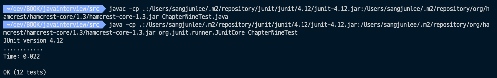

# CHAPTER09. JUnit으로 테스팅하기 (Junit4 기준)

[[toc]]

## JUnit 테스트

- TDD(Test-Driven Development)를 구현하기 위한 대표적인 테스팅 프레임워크
- Q & A가 모두 존재하는 상황에서 풀이과정을 만들면서 A가 나오는지를 확인하기 위한 과정
- 모든 함수와 모든 가능한 A에 대해서 작성하면 좋지만 쉽지 않다
- 특히 초기 개발 단계에서 메소드 시그니처가 변경되는 일이 자주 발생할수 있고, 아예 별로 클래스로 분리해버린다거나 코드 구조를 자주 바꾸는 상황이 생길 수 있는데 이때 모든 테이스를 변경하는게 생각보다 쉽지 않다

### Q1. JUnit 테스트를 통해 얻는 가치는 무엇인가

- 개인적으로 생각하는 가장 큰 가치는 유지보수의 용이성이 아닐까
- 코드를 작성하다보면 작년의 나, 저번달의 나에게 '왜 이렇게 짰어?..' 라고 묻는 경우가 있다. 혹은 그 당시 개발했던 요건이 기억나지 않는다던가
- 하지만 완성해놓은 테스트 코드는 답을 알고 있기 때문에 그 결과가 나오도록 수정만 하면된다
- 소스 리팩토링 시에도 모든 테스트 코드가 통과하도록 리팩토링 해나가면 맞게 수정했는지 의심할 필요가 없어진다. (물론 통합테스트에서 문제가 생길 가능성은 예외다)
- 요건 변경으로 Answer가 바뀌었다면 테스트 코드의 expect value들만 변경하고 코드를 수정하면 자신감 있게 코드를 수정할 수 있다.
- 특히 남이 짜던 코드를 받았을때 테스트 코드가 있을 때와 없을때를 가정한다면...

### Q2. JUnit 테스트는 어떻게 실행하는가

#### 1. IDE 활용

- 어지간한 IDE는 UI로 Run|Debug 버튼을 제공해주니 버튼눌러서 실행하면된다.

#### 2. cli 활용

- cli 에서도 junit.jar 의존성을 추가해서 실행이 가능하다.
- 매우 귀찮으니까 하지말자(차라리 maven을 써서 돌려라)

  

``` sh
# java compile with junit & hamcrest library(useless junit ^4.9.0)
javac -cp .:/Users/sangjunlee/.m2/repository/junit/junit/4.12/junit-4.12.jar:/Users/sangjunlee/.m2/repository/org/hamcrest/hamcrest-core/1.3/hamcrest-core-1.3.jar ChapterNineTest.java

## run
java -cp .:/Users/sangjunlee/.m2/repository/junit/junit/4.12/junit-4.12.jar:/Users/sangjunlee/.m2/repository/org/hamcrest/hamcrest-core/1.3/hamcrest-core-1.3.jar org.junit.runner.JUnitCore ChapterNineTest
```

#### 3. maven 등 빌드 툴 활용

``` sh
# Run all test
mvn clean test
# Run specific test class
mvn clean test -Dtest=com.mbio.book.ChapterNineTest
# Run sepcific test method
mvn clean test -Dtest=com.mbio.book.ChapterNineTest#testAssertArrayEquals
```

## JUnit 테스트 생명 주기

- Junit 4 기준

### Q3. JUnit 테스트를 실행할 때 어떤 일이 일어나는가

1.BeforeClass

- public static void no-arg method 에서만 쓰여야 한다
- JVM class loading과 무관하게 JUnit 이 명시적으로 Test Class instance가 호출되기 전에 한번 만 수행해준다.
- 생성 비용이 비싼 static resource 초기화에 사용한다.
- Junit5의 @BeforeAll 과 동일

2.Before

- public void no-arg method 에서만 쓰여야 한다
- 모든 test 어노테이션 전에 실행되는 어노테이션
- 코드 중복 방지를 위해서 쓰거나, 테스트 전 리소스 초기화 등을 위해 사용한다.
- JUnit5의 @BeforeEach 와 동일

3.Test

- 실제 테스틀 위한 public void mehtod
- 언제 어떤 test 어노테이션이 실행될 지 알 수 없으므로, 모든 테스트 메소드는 의존성 없이 독립적으로 작성되어야 한다

4.After

- Before와 거의 유사하며 모든 test 어노테이션 수행 후에 수행된다

5.AfterClass

- BeforeClass 와 거의 유사하며 static resouce 해제에 사용

JUnit LifeCycle 확인

``` java
@BeforeClass static method invoked.
Constructor invoked. Instance: com.mbio.book.ChapterNineTest@42110406
@Before method invoked. Instance: com.mbio.book.ChapterNineTest@42110406
test method name : testAssertNotNull
@After method invoked. Instance: com.mbio.book.ChapterNineTest@42110406
Constructor invoked. Instance: com.mbio.book.ChapterNineTest@30946e09
@Before method invoked. Instance: com.mbio.book.ChapterNineTest@30946e09
test method name : testAssertNotSame
@After method invoked. Instance: com.mbio.book.ChapterNineTest@30946e09
@AfterClass static method invoked.
```

## JUnit 사용의 좋은 예

### Q4. 테스트가 성공인지 어떻게 증명할 수 있는가

- JUnit의 핵심인 Assert를 이용해 예상값과 일치하는지 확인

``` s
assertEquals : 두 개의 객체가 자신들의 equals 메소드에 따라 같은지 비교
assertArrayEquals : 두 배열에 같은 값이 있는지 검증
assertTrue & assertFalse : 주어진 상태를 Boolean 예상 값과 비교
assertNotNull : 객체가 null이 아님
assertThat : 전달된 객체가 Matcher 조건에 맞는지 검증
```

Sample Code

``` java

public class ChapterNineTest {
  @Test
  public void testAssertArrayEquals() {
    byte[] expected = "trial".getBytes();
    byte[] actual = "trial".getBytes();
    assertArrayEquals("failure - byte arrays not same", expected, actual);
  }

  @Test
  public void testAssertEquals() {
    assertEquals("failure - strings are not equal", "text", "text");
  }

  @Test
  public void testAssertTrue() {
    assertTrue("failure - should be true", true);
  }

  @Test
  public void testAssertFalse() {
    assertFalse("failure - should be false", false);
  }

  @Test
  public void testAssertNotNull() {
    assertNotNull("should not be null", new Object());
  }

  @Test
  public void testAssertNotSame() {
    assertNotSame("should not be same Object", new Object(), new Object());
  }

  @Test
  public void testAssertNull() {
    assertNull("should be null", null);
  }

  @Test
  public void testAssertSame() {
    Integer aNumber = Integer.valueOf(768);
    assertSame("should be same", aNumber, aNumber);
  }

  // JUnit Matchers assertThat
  @Test
  public void testAssertThatBothContainsString() {
    assertThat("albumen", both(containsString("a")).and(containsString("b")));
  }

  @Test
  public void testAssertThatHasItems() {
    assertThat(Arrays.asList("one", "two", "three"), hasItems("one", "three"));
  }

  @Test
  public void testAssertThatEveryItemContainsString() {
    assertThat(Arrays.asList(new String[] { "fun", "ban", "net" }), everyItem(containsString("n")));
  }

  @Test(expected = IllegalAccessException.class)
  public void testExpected() throws IllegalAccessException {
    throw new IllegalAccessException();
  }

  // Core Hamcrest Matchers with assertThat
  @Test
  public void testAssertThatHamcrestCoreMatchers() {
    assertThat("good", allOf(equalTo("good"), startsWith("good")));
    assertThat("good", not(allOf(equalTo("bad"), equalTo("good"))));
    assertThat("good", anyOf(equalTo("bad"), equalTo("good")));
    assertThat(7, not(CombinableMatcher.<Integer>either(equalTo(3)).or(equalTo(4))));
    assertThat(new Object(), not(sameInstance(new Object())));
  }
}
```

### Q5. 어떻게 특정 예외를 예상할 수 있는가

- ```@Test``` anotation에 expected를 추가해서 에러 발생을 정상 테스트로 만들 수 있음
- Custom Exception을 만들었거나, 원치 않는 값이 입력되었을때 정상적으로 에러를 뱉어내는지 검증하고 싶으면 사용한다

expected example

``` java
@Test(expected = IllegalAccessException.class)
public void testExpected() throws IllegalAccessException {
  System.out.println(getCurrentMethodName());
  throw new IllegalAccessException();
}
```

### Q6. 테스트가 예상했던 시간 안에 완료되지 않으면 테스트가 실패하게 만들 수 있는가

- ```@Test``` anotation에 timeout 속성을 추가해서 할 수 있음

``` java
@Test(timeout = 1000L)
public void testTimeout() {
  try {
    Thread.sleep(1001);
  } catch (InterruptedException e) {
    e.printStackTrace();
  }
}
```

### Q7. @RunWith 어노테이션은 어떻게 작동하는가

- ```@RunWith``` anotation은 Runner를 상속받은 class와 함께 사용되는 Class수준의 어노테이션
- 개별적으로 아래의 Runner를 구현해 별개의 TestRunner를 작성할 수 있다.
- 실행할 테스트 목록을 가져오는 getDescription 과 실제 테스틀 수행할 run 메소드를 작성해서 개별 테스트 러너를 만들고 RunWith 어노테이션으로 실행이 가능하다.

``` java
public abstract class Runner implements Describable {
    /*
     * (non-Javadoc)
     * @see org.junit.runner.Describable#getDescription()
     */
    public abstract Description getDescription();

    /**
     * Run the tests for this runner.
     *
     * @param notifier will be notified of events while tests are being run--tests being
     * started, finishing, and failing
     */
    public abstract void run(RunNotifier notifier);

    /**
     * @return the number of tests to be run by the receiver
     */
    public int testCount() {
        return getDescription().testCount();
    }
}

```

### Q8. 실행 중인 테스트들을 사용자화하려면 어떻게 해야 하는가

- Q7로 대체

## 목으로 의존성 제거하기

### Q9. 단위 테스트와 통합 테스트의 차이는 무엇인가

- 단위 테스트란 의존성 없이 독립적으로 하나의 기능 단위별(함수별, 클래스별 등) 개발 코드가 정상적으로 동작하는지를 테스트 하는 것
- 통합 테스트란 DB, MQ, 서버 호출 등 여러 환경과 통합된 테스트를 수행하는 것
- 하지만 완전히 의존성 없는 테스트가 불가능 하기 때문에 고안된 것이 바로 Mock을 이용하는 방법이다. 대표적으로 Mockito 라이브러리가 사용된다.

### Q10. 테스트의 의미가 더 잘 표현되게 하려면 어떤 방법을 사용해야 하는가

- Hamcrest를 이용하면 좀더 가독성 있는 Matchers 표현이 가능하다.
- 모국어가 영어면 책읽듯이 읽을거같다

``` java
@Test
public void testAssertThatHamcrestCoreMatchers() {
  System.out.println(getCurrentMethodName());
  assertThat("good", allOf(equalTo("good"), startsWith("good")));
  assertThat("good", not(allOf(equalTo("bad"), equalTo("good"))));
  assertThat("good", anyOf(equalTo("bad"), equalTo("good")));
  assertThat(7, not(CombinableMatcher.<Integer>either(equalTo(3)).or(equalTo(4))));
  assertThat(new Object(), not(sameInstance(new Object())));
}
```

## 행위 주도 개발을 이용해 시스템 테스트 만들기

### Q11. 행위 주도 개발이란 무엇인가

- BDD(Behavior-Driven Development) 행위 주도 개발
- 시나리오를 기반으로 테스트 케이스 작성
- 비 개발자가 봐도 읽을 수 있을 정도로 이해할 수 있는 수준으로 작성
- 테스트 케이스가 그자체로 요구사항이 되도록
- 가장 대표적인 무료 라이브러리로는 [cucumber](https://cucumber.io/)가 있다

기본 패턴

``` s
Feature : 테스트에 대상의 기능/책임을 명시
Scenario : 테스트 목적에 대한 상황을 설명
Given : 시나리오 진행에 필요한 값을 설정
When : 시나리오를 진행하는데 필요한 조건을 명시
Then : 시나리오를 완료했을 때 보장해야 하는 결과를 명시
```
